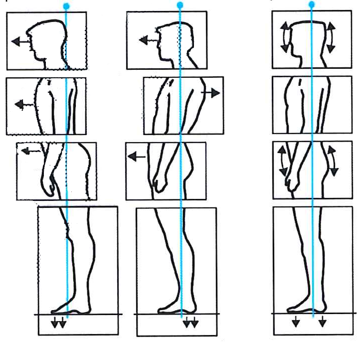
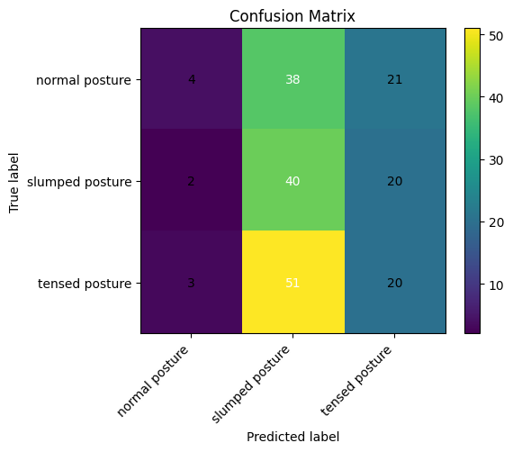
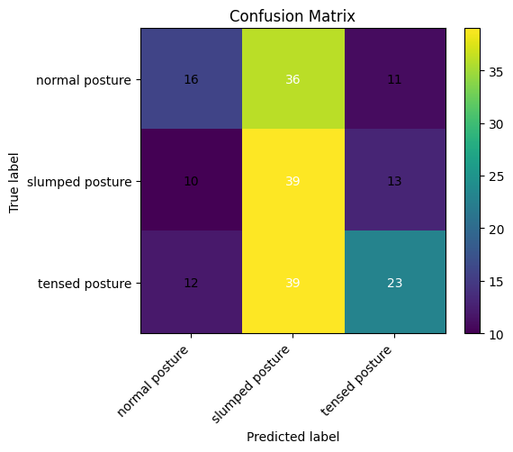
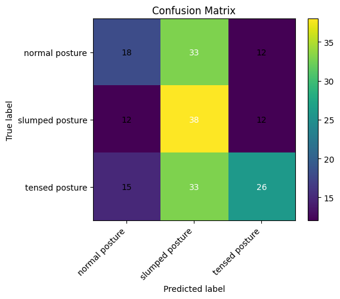
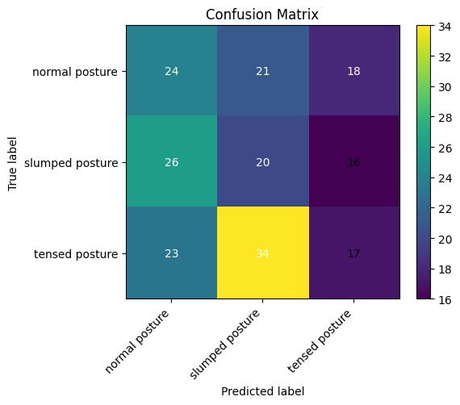
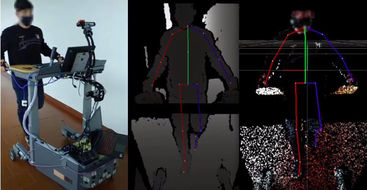
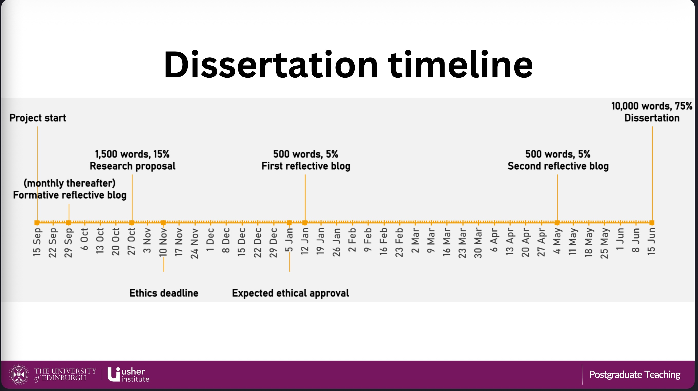

\clearpage

# MSc in Data Science for Health and Social Care

Examination Number: B248593

First reviewer: Dr. Ahmar Shah

Second reviewer: John Wilson

## Dissertation Title

*Detecting Movement Imbalances using custom TensorFlow Lite Models utilizing the Google MediaPipe framework.*

# 1. Introduction

Healthcare is increasingly recognizing the importance of movement quality and postural balance in preventing injury, managing chronic conditions, and optimizing physical performance [@Whittaker2017]. @Wijekulasuriya2025 found in an extensive actual meta analysis that traditional methods for assessing posture and movement often rely on subjective clinical observations, limiting their accessibility and consistency. Advances in artificial intelligence (AI) and computer vision offer promising avenues for developing such objective tools that are scalable and run on consumer hardware that is widely available [@Google2024; @Bazarevsky2020]. This dissertation explores the development of Convolutional Neural Networks (CNNs) through transfer learning within the Google MediaPipe framework to detect and analyze head-neck-torso alignment.

## 1.1 Background and rationale

Human posture and coordination are central to both health and performance. Impairments such as muscular tension, poor motor control, or postural imbalance contribute significantly to discomfort, injury, and reduced physical performance in daily and professional life [@Kubalek-Schrder2013]. Advanced motor skills rely on precise kinaesthetic differentiation, including fine motor control, proprioceptive sensitivity, accurate force regulation, coordinated timing, and the economy of movement. These elements form the basis of effective movement in sports, rehabilitation, and everyday function [@ZauckerP2010]. Recent research highlights that chronic low back pain and other movement system impairments are closely associated with sustained postural deviations and maladaptive movement patterns that often develop gradually and may not be apparent during isolated clinical assessments [@Sahrmann2017; @Ge2022].

Traditional approaches to assessing posture and coordination rely on subjective evaluations, clinical observation, expensive motion analysis systems, or extensive practitioner expertise. While commercial software for posture assessment exists, these solutions often require professional oversight and remain limited in their ability to capture subtle or habitual patterns of imbalance consistently [@Badhe2018]. This highlights a clear gap between the qualitative nature of clinical assessments and the potential for more objective, data-driven methods enabled by modern machine learning techniques.

Recent advances in computer vision and artificial intelligence provide opportunities to bridge these limitations. Convolutional Neural Networks (CNNs) have demonstrated high accuracy in identifying patterns within image and video data and are increasingly applied in gait analysis, posture detection, and motion tracking [@Jiang2023]. Among available frameworks, the Google MediaPipe framework brings a lightweight approach that can be run in the browser or on mobile devices, utilizing a statistical 3D human shape modelling pipeline offered as a trainable and modular deep learning framework. It can accurately represent full-body details to detect pose and posture [@Xu2020; @Bazarevsky2020].

As a physiotherapist with focus on movement quality, I found these gaps were not purely academic but deeply practical in my clinical practice. To reach a level of good understanding of movement (patterns) it required years of training and clinical experience to develop. For instance the ability to accurately assess the quality of movement based on key indicators such as the passive rotatory mobility of the fifth thoracic vertebra (Th5) and adjacent vertebrae [@Tachihara2019]. The possibility of using lightweight computer vision to complement clinical expertise, enhance rehabilitation outcomes, and support performance improvement is therefore highly compelling.

## 1.2 Research question, aim, and objectives

**Research question**\
How can transfer learning on a pre-existing TensorFlow Lite model for pose estimation and image classification be used to detect and analyze posture and movement imbalances?

**Aim**\
Finetuning and evaluation of a deep learning model for posture and movement quality assessment that detects and interprets imbalances in the head, neck torso and to make it suitable for the clinical context.

**Objectives**

1.  To finetune an pre-trained Google MediaPipe image classification model for posture and movement imbalance detection.
2.  To evaluate the performance of the finetuned classification model.
3.  To detect and analyze indicators of posture imbalances, including the alignment angles of the head, neck and torso including asymmetries or hyper tension in muscle contours.

## 1.3 Dissertation structure

The present work is structured as follows:

Chapter 2 provides a comprehensive literature review of the current state of AI-based posture and movement analysis, with a focus on the capabilities and limitations of existing pose estimation frameworks such as Google MediaPipe.

Chapter 3 outlines the methodology, including the study design, data sources, variable definitions, model development approach, and performance evaluation strategy.

Chapter 4 details the implementation of the training and inference pipelines.

Chapter 5 presents the results of model performance and error analysis.

Chapter 6 discusses the findings in relation to existing literature, strengths and limitations, and clinical implications.

Chapter 7 addresses ethical considerations, information governance, and data management.

Chapter 8 outlines the expected impact and dissemination plans, while

Chapter 9 concludes with a summary of contributions and future work directions.

\clearpage

# 2. Literature Review

Recent validation studies comparing MediaPipe with gold-standard motion capture systems reveal measurable discrepancies in landmark accuracy, particularly for subtle postural features, highlighting the need for domain-specific refinement for clinical use [@Kakuta2022]. Here "subtle" means muscular tension with small or no movement of (body-)parts. More broadly, current pose estimation models remain limited by sensitivity to noise and 2D–3D estimation gaps, reducing their reliability for detecting the named tensions and asymmetries critical to movement and pose imbalance analysis [@Kakuta2022; @Lachance2023]. Fairness and representativeness in pose estimation systems are also important concerns: current Pose Estimation Models (PEMs) exhibit performance disparities across demographic groups, with reduced accuracy for under-represented populations in training datasets [@Lachance2023]. Available datasets frequently focus on male and predominantly white participants between the ages of 19 and 50, while under-representing females, older adults, and individuals with darker skin tones, thereby increasing the risk of systematic bias and reduced generalizability in movement and posture analysis.”

Consequently, while MediaPipe Pose serves as a robust foundation for pose detection, in its standard configuration of training it does not inherently capture the fine-grained symmetry metrics, sagittal and coronal balance indicators, or compensatory movement patterns that rely on hyper- and hypo-tension that are essential for clinical postural and even more for movement analysis. Computer-vision-based deep learning markerless systems nonetheless represent an important step towards closing the gap between theoretical research, that can be even a century old like the principle of primary control of human movement by @AlexanderFM2017, and practical implementation in remote clinical assessment [@Wagh2024; @UltralyticsInc2025].

This project uses transfer learning [@Kakuta2022] to adapt a pre-trained Google MediaPipe CNN model, originally trained on extensive image data, to a new small Kaggle dataset but with more relevant and higher-quality images for posture imbalance detection. By utilizing pre-learned feature representations, the model can achieve faster convergence and improved accuracy even with a comparatively smaller or domain-specific dataset.

## 2.1 Market research

Modern video analysis with the purpose of detecting pose, movement, and specific markers in sports activities has undergone a paradigm shift, moving from subjective clinical intuition to high-fidelity, data-driven kinematic quantification. Commercial ecosystems like @MAR-Systems-Ltd2026 leverage dual-camera 3D reconstruction to analyze over 40 biomechanical metrics without intrusive markers, targeting retail efficiency and rapid, evidence-based footwear recommendations. Similarly, @RunDNA2026 employs advanced motion capture to track kinetic and kinematic variables from foot strike to toe-off, providing practitioners with a granular, 3D anatomical breakdown of movement asymmetries. For integrated clinical environments, the @Medical-XPRT2026 combines 3D camera technology with a sensorized, load-cell-equipped treadmill to provide real-time biofeedback and synchronized gait analysis. Supplementing these laboratory-grade tools, @Running-Reborn-20262026 utilizes wearable inertial measurement units (IMUs) to provide continuous, longitudinal monitoring of temporal outcomes like ground contact time and cadence, albeit with sensitivity to speed-dependent discrepancies. At the vanguard of performance capture, @Move-AI-Ltd2026 offers sophisticated, markerless motion capture solutions that utilize computer vision to extract high-fidelity skeletal data from multi-camera footage, facilitating biomechanical analysis outside of traditional studio settings.

The overarching advantage of these commercial approaches lies in their ability to translate complex, high-frequency spatial-temporal data into actionable clinical diagnostics. They reduce inter-rater variability, the differences between multiple assessors, and enable objective longitudinal tracking. Such standardization of classification, may improve the reliability of qualitative (and quantitative) movement assessments in evidence-based rehabilitation settings. Conversely, the disadvantages often involve high capital expenditure, the requirement for controlled capture environments, and often a reliance on proprietary pipelines that can be difficult to consistently integrate into existing clinical (analytical) workflows.

When evaluated against image classification models, the advantages of the latter become apparent: low-cost, low-latency identification of specific postural states and movement patterns, albeit at the expense of the quantitative kinematic precision provided by advanced motion-capture and biomechanical analysis systems.

\clearpage

# 3. Methodology

In this work, we will apply a quantitative, observational design to explore the feasibility of using transfer learning on a pre-trained TensorFlow Lite model for posture and movement imbalance detection. The study will involve secondary data analysis of an existing image dataset curated for posture analysis, with a focus on evaluating the performance of a finetuned CNN model within the Google MediaPipe framework.

## 3.1 Study design and setting

This study is a secondary data analysis exploring postural and movement imbalance detection using artificial intelligence. The project applies a quantitative, observational design, analyzing existing image data through supervised machine learning, specifically Convolutional Neural Networks (CNNs) implemented via TensorFlow Lite within the Google MediaPipe framework. The aim is to evaluate whether lightweight AI models can detect subtle patterns of imbalance in posture and coordination and to adapt them for potential clinical use through transfer learning on a posture-specific dataset.

The study will be conducted remotely using a secondary dataset. All data analysis will be performed on secured infrastructure provided by the University of Edinburgh. No new data collection or participant interaction is planned.

## 3.2 Data source and characteristics

This study uses secondary image data of an openly available "Posture Keypoints Detection – Photos & Labels" dataset on Kaggle. The dataset consists of 300 images in static side view with image resolutions of up to around 1.6 MP and an overall high quality look.

Unlike large-scale, general-purpose image datasets, this Kaggle dataset is specifically curated for posture analysis. It focuses on side-view images suitable for assessing sagittal-plane alignment and upper-body posture. The relatively small dataset size and potential demographic limitations may constrain generalizability and fairness.

## 3.3 Variables, features, and preprocessing

The posture was classified into 3 types of poses regarding posture classifications by @Klein-Vogelbach1990 as you see in the following illustration:



**The classes**

- "tensed posture" (left on the illustration)

- "slumped posture" (middle)

- "normal posture" (right)

The author manually annontated and applied the 300 images to one of these classes according to his clinical experience in the field of orthopaedics and functional movement therapy.

**Primary outcomes**

- Head-neck-torso alignment: Angular relationships and relative positioning of the head, cervical spine, and torso.
- Postural coordination: Upper-body skeletal alignment patterns derived from keypoints and CNN feature maps.
- Movement imbalance indicators: Detection of asymmetries, misalignments, or inefficient posture as inferred from pose landmarks.

**Exposures/independent variables**

- Image category/context: Static posture images in standardized side view.
- Camera/view angle: Minor variation in pose estimation accuracy depending on exact lateral positioning.

**Covariates/control features**

- Image characteristics: Resolution, background, and lighting, which may influence model performance.
- Posture variation: Degree of anterior head translation, kyphosis, and other sagittal-plane deviations.

**Extracted features**

- Skeletal keypoints: Annotated landmarks in YOLO pose format and MediaPipe Pose outputs.
- Kinematic proxies: Angular relationships between key joints and segments.
- Postural imbalance markers: Anterior head translation, sagittal imbalance, and deviations from expected alignment patterns.

All selected images from the Kaggle dataset will undergo preprocessing prior to model training, including resizing, normalization, and verification of annotation integrity. Where appropriate, data augmentation (e.g., small rotations, cropping, brightness adjustments) will be applied to improve generalization while preserving clinically meaningful posture characteristics.

## 3.4 Model development and transfer learning

This study employs a transfer learning approach to develop a domain-specific TensorFlow Lite model suitable for clinical posture and movement analysis. Transfer learning enables the adaptation of pre-trained CNN architectures—such as those used within MediaPipe and trained on large-scale datasets like ImageNet—to the focused task of detecting head-neck-torso imbalances. In practice, base model weights are kept frozen or partially frozen, while classification and selected high-level layers are retrained using the Kaggle posture dataset.

Deploying the resulting model as a quantized TensorFlow Lite artefact supports real-time, on-device inference on mobile and edge devices, reducing latency and preserving user privacy by processing data locally.

## 3.5 Analysis and performance evaluation

The analysis will proceed in two phases:

1.  Descriptive analysis of dataset composition, annotation completeness, and posture-related metrics.
2.  AI-based classification and pattern recognition using transfer learning and supervised deep learning methods.

Model performance will be evaluated using accuracy as the primary metric and, where feasible, precision, recall, F1-score, and confusion matrices. Robustness and generalization will be explored through limited distribution-shift experiments (e.g., withheld images with slight background or lighting variation). All hyperparameters, data splits, and preprocessing steps will be documented to ensure reproducibility.

\clearpage

# 4. Implementation

This chapter documents the systems, pipelines and automation used to prepare the data, train and evaluate models, and produce deployable inference artifacts. It covers the research environment and names reproducible steps to build the training pipeline and maintain the data-engineering workflows (including the n8n augmentation workflow).

## 4.1 Research setup

- Hardware and runtime: local development was performed on a macOS workstation for editing and lightweight test runs; heavier training runs were executed on a cloud VM.

- **Representative software stack**

  - Python 3.10 for MediaPipe model maker, Python 3.13 for inference of the TFLite model
  - TensorFlow 2.x with TFLite support
  - MediaPipe (python bindings or containerised MediaPipe runtime)
  - OpenCV, NumPy, pandas, scikit-learn, Matplotlib
  - Jupyter notebook
  - Quarto (for rendering `Dissertation.qmd`)
  - Docker & Docker Compose
  - Jenkins (CI server)
  - n8n (automation/workflows)
  - GitHub Actions (dissertation artifact build)

- **Environment manifests used in this project (congested by Dockerfiles)**

  - `code/environment.yml`
  - `code/environment_model-maker.yml`
  - `code/requirements.txt`
  - `code/requirements_model-maker.txt`

- **Example reproducible local environment:**

``` bash
conda env create -f code/environment.yml
conda activate dissertation
```

## 4.2 Training pipeline and data engineering

Overview - The training pipeline follows an ETL pattern: ingest → validate → augment → split → train → evaluate → archive. Steps are implemented in the repository as Jupyter notebooks and scripts to allow both interactive experimentation and non-interactive CI execution.

Data ingestion and annotation - Source images are stored under `data/`. Annotations use a YOLO-pose-like format and MediaPipe keypoints where available. Initial selection and validation are performed in the notebooks (see `code/*.ipynb`).

Automated augmentation (n8n + MediaPipe) - To expand the original 300 images, the repository uses an n8n workflow to produce duplicates with MediaPipe keypoint overlays and controlled image edits (rotations, crops, brightness adjustments). - The exported n8n workflow is available at `code/n8n/Dissertation_Posture_Analysis.json`. The high-level workflow:

1.  Read a list of source images (the initial 300).

2.  For each image, call a MediaPipe inference endpoint (either the containerized `code/mediapipe_pose.py` service or an HTTP MediaPipe API) using an `HTTP Request` node.

3.  Receive keypoint coordinates and render overlay images server-side (via the MediaPipe container or a rendering script).

4.  Save augmented images to `data/` and record augmentation metadata (source id, parameters).

5.  Optionally trigger a downstream training job (Jenkins) or commit augmented data back to the repository index. - This decoupled approach produces auditable augmentation runs and keeps augmentation reproducible.

Training execution - Training can be run interactively (via `custom_image_classifier_model_training.ipynb`) or non-interactively inside a container built from `code/Dockerfile`.

Augmentation & split policy - Augmentations used: small rotations (±10°), random crops (±10%), brightness/contrast jitter, and MediaPipe keypoint overlays. Horizontal flips are used when anatomically appropriate. - Splits are deterministic and saved to `data/splits/` for reproducibility.

Artifacts and model storage - Model artifacts (.h5 and .tflite), logs and run figures are stored under `data/models/` and `runs/`. Each run directory includes metadata (git commit, config checksum, timestamp).

## 4.3 Inference pipeline, containerization and CI/CD

Inference packaging - Inference scripts live in `scripts/` (for example `custom_tflite_image_classifier.py` and `custom_tflite_pose.py`) and operate against quantized `.tflite` models exported to `data/models/`. - Local inference example:

``` bash
python scripts/custom_tflite_image_classifier.py --model data/models/<run>/model.tflite --image data/images/example.jpg
```

**Containerisation and compose**

\- The project maintains two primary Dockerfile artifacts:

\- `code/Dockerfile` — training and utilities image.

- `code/Dockerfile_mediapipe`

MediaPipe runtime used for keypoint extraction and overlay rendering. Multi-service development is defined in:

\- `code/docker-compose.yml`

\- Start development services:

``` bash
docker compose -f code/docker-compose.yml up --build
```

**CI/CD**

Jenkins webhook for heavy builds and notebook images - Jenkins is used for build a Jupyter environment on a server to run model training and it also builds an Streamlit Webapp for inference testing of (build) models:

1.  Configure a GitHub webhook to post push events to the Jenkins pipeline endpoint.

2.  Jenkins uses the pipeline-as-code defined in `code/Jenkinsfile` to:

    \- Checkout the commit.

    \- Build and run Docker containers

**CI/CD**

GitHub Actions for Quarto artifacts

\- A GitHub Actions workflow (run manually) renders the dissertation via Quarto:

\- Checkout repository. - Install Quarto and LaTeX (for PDF rendering).

\- Run `quarto render Dissertation.qmd --to html` and `--to pdf`.

\- Upload the generated HTML and PDF as workflow artifacts or deploy to `gh-pages`.

\- This ensures the dissertation site and PDF are rebuilt and archived automatically on changes.

Automation orchestration (n8n) - `n8n` runs as a containerized service and hosts the augmentation workflow. Responsibilities:

\- Orchestrate MediaPipe API calls and rendering.

\- Persist augmented images and artifacts on a MinIO file storage.

For Reproducibility — developer quick-start to set up and run locally:

``` bash
conda env create -f code/environment.yml
conda activate dissertation
pip install -r code/requirements.txt  # normally done by conda script before!
docker compose -f code/docker-compose.yml build
docker compose -f code/docker-compose.yml up -d
```

\clearpage

# 5. Results

These results are from four model builds with Keras and TensorFlow, and evaluated on the same image data set and with identical preprocessing steps and configuration.

## 5.1 Dataset and preprocessing outcomes

The dataset and splits used across all runs were consistent. The training set contained 1,890 images distributed across three classes, and both the validation and test splits contained 199 images each. To achieve this number from 300 original images, augmentation was applied. First, a subset of duplicated 300 images with body landmarks as overlay were added. This was achieved by an existing MediaPipe Pose model which was adding these annotations. Second, the images were duplicated several times and processed via random image editing utilizing the OpenCV framework. For instance, the colour-theme or background colour were changed, images were cropped or tilted. For each augmented image, 2 changes were applied. The final class counts were as follows:

- Train split (total = 1890):
  - normal posture: 630
  - slumped posture: 651
  - tensed posture: 609
- Validation split (total = 199):
  - normal posture: 69
  - slumped posture: 69
  - tensed posture: 61
- Test split (total = 199):
  - normal posture: 63
  - slumped posture: 62
  - tensed posture: 74

Preprocessing was applied consistently for all runs (same processed image data set) to maintain comparability between architectures.

## 5.2 Model performance

Four training runs were performed using different base architectures. For each run the reported metrics below are derived from evaluation on the held-out test split and from prediction-derived analysis.

### Training 1 (EfficientNet-Lite0 architecture)

Prediction-derived overall accuracy: 0.3216

Model evaluate(internal performance metric) loss/accuracy on dataset_obj: 0.638240/0.824121

**Confusion matrix**

| True predicted | normal | slumped | tensed |
|----------------|-------:|--------:|-------:|
| normal         |      4 |      38 |     21 |
| slumped        |      2 |      40 |     20 |
| tensed         |      3 |      51 |     20 |

**Row-normalized confusion matrix (recall by class)**

| True predicted | normal | slumped | tensed |
|----------------|-------:|--------:|-------:|
| normal         | 0.0635 |  0.6032 | 0.3333 |
| slumped        | 0.0323 |  0.6452 | 0.3226 |
| tensed         | 0.0405 |  0.6892 | 0.2703 |

Per-class support:

- normal posture: 63
- slumped posture: 62
- tensed posture: 74

Balanced accuracy (macro recall): 0.3263

**Classification report**

| Class           | Precision | Recall | F1-score | Support |
|-----------------|----------:|-------:|---------:|--------:|
| normal posture  |    0.4444 | 0.0635 |   0.1111 |      63 |
| slumped posture |    0.3101 | 0.6452 |   0.4188 |      62 |
| tensed posture  |    0.3279 | 0.2703 |   0.2963 |      74 |
| Accuracy        |           |        |   0.3216 |     199 |
| Macro avg.      |    0.3608 | 0.3263 |   0.2754 |     199 |
| Weighted avg.   |    0.3592 | 0.3216 |   0.2759 |     199 |



### Training 2 (EfficientNet-Lite2 architecture)

Prediction-derived overall accuracy: 0.3920

Model evaluate(internal performance metric) loss/accuracy on dataset_obj: 0.645087/0.849246

**Confusion matrix**

| True predicted | normal | slumped | tensed |
|----------------|-------:|--------:|-------:|
| normal         |     16 |      36 |     11 |
| slumped        |     10 |      39 |     13 |
| tensed         |     12 |      39 |     23 |

**Row-normalized confusion matrix (recall by class)**

| True predicted | normal | slumped | tensed |
|----------------|-------:|--------:|-------:|
| normal         | 0.2540 |  0.5714 | 0.1746 |
| slumped        | 0.1613 |  0.6290 | 0.2097 |
| tensed         | 0.1622 |  0.5270 | 0.3108 |

Per-class support:

- normal posture: 63
- slumped posture: 62
- tensed posture: 74

Balanced accuracy (macro recall): 0.3979

**Classification report**

| Class           | Precision | Recall | F1-score | Support |
|-----------------|----------:|-------:|---------:|--------:|
| normal posture  |    0.4211 | 0.2540 |   0.3168 |      63 |
| slumped posture |    0.3421 | 0.6290 |   0.4432 |      62 |
| tensed posture  |    0.4894 | 0.3108 |   0.3802 |      74 |
| Accuracy        |           |        |   0.3920 |     199 |
| Macro avg.      |    0.4175 | 0.3979 |   0.3801 |     199 |
| Weighted avg.   |    0.4219 | 0.3920 |   0.3797 |     199 |



### Training 3 (EfficientNet-Lite4 architecture)

Prediction-derived overall accuracy: 0.4121

Model evaluate(internal performance metric) loss/accuracy on dataset_obj: 0.703537/0.758794

**Confusion matrix**

| True predicted | normal | slumped | tensed |
|----------------|-------:|--------:|-------:|
| normal         |     18 |      33 |     12 |
| slumped        |     12 |      38 |     12 |
| tensed         |     15 |      33 |     26 |

**Row-normalized confusion matrix (recall by class)**

| True predicted | normal | slumped | tensed |
|----------------|-------:|--------:|-------:|
| normal         | 0.2857 |  0.5238 | 0.1905 |
| slumped        | 0.1935 |  0.6129 | 0.1935 |
| tensed         | 0.2027 |  0.4459 | 0.3514 |

Per-class support:

- normal posture: 63
- slumped posture: 62
- tensed posture: 74

Balanced accuracy (macro recall): 0.4167

**Classification report**

| Class             | Precision | Recall |   F1-score | Support |
|-------------------|----------:|-------:|-----------:|--------:|
| normal posture    |    0.4000 | 0.2857 |     0.3333 |      63 |
| slumped posture   |    0.3654 | 0.6129 |     0.4578 |      62 |
| tensed posture    |    0.5200 | 0.3514 |     0.4194 |      74 |
| **Accuracy**      |           |        | **0.4121** |     199 |
| **Macro avg.**    |    0.4285 | 0.4167 |     0.4035 |     199 |
| **Weighted avg.** |    0.4338 | 0.4121 |     0.4041 |     199 |



### Training 4 (MobileNet-V2 architecture)

Prediction-derived overall accuracy: 0.3065

Model evaluate(internal performance metric) loss/accuracy on dataset_obj: 0.736599/0.748744

**Confusion matrix**

| True predicted | normal | slumped | tensed |
|----------------|-------:|--------:|-------:|
| normal         |     24 |      21 |     18 |
| slumped        |     26 |      20 |     16 |
| tensed         |     23 |      34 |     17 |

**Row-normalized confusion matrix (recall by class)**

| True predicted | normal | slumped | tensed |
|----------------|-------:|--------:|-------:|
| normal         | 0.3810 |  0.3333 | 0.2857 |
| slumped        | 0.4194 |  0.3226 | 0.2581 |
| tensed         | 0.3108 |  0.4595 | 0.2297 |

Per-class support:

- normal posture: 63
- slumped posture: 62
- tensed posture: 74

Balanced accuracy (macro recall): 0.3111

**Classification report**

| Class             | Precision | Recall |   F1-score | Support |
|-------------------|----------:|-------:|-----------:|--------:|
| normal posture    |    0.3288 | 0.3810 |     0.3529 |      63 |
| slumped posture   |    0.2667 | 0.3226 |     0.2920 |      62 |
| tensed posture    |    0.3333 | 0.2297 |     0.2720 |      74 |
| **Accuracy**      |           |        | **0.3065** |     199 |
| **Macro avg.**    |    0.3096 | 0.3111 |     0.3056 |     199 |
| **Weighted avg.** |    0.3111 | 0.3065 |     0.3038 |     199 |



## 5.3 Error analysis

Across all experiments a consistent pattern of misclassification is apparent. The models show relatively high recall for the `slumped posture` class but lower precision, indicating a tendency to predict `slumped` for a wide range of inputs. `Normal posture` is frequently misclassified (low recall in several runs), and `tensed posture` predictions vary by architecture: deeper Lite variants tended to improve overall discrimination.

- Best overall accuracy and balanced recall were achieved by EfficientNet-Lite4 (accuracy 0.4121, balanced accuracy 0.4167).
- EfficientNet-Lite2 performed second best (accuracy 0.3920, balanced accuracy 0.3979).
- EfficientNet-Lite0 and MobileNet-V2 produced lower overall accuracy (0.3216 and 0.3065 respectively) and lower balanced accuracy.

Common failure modes observed in confusion matrices:

- Confusion between `normal` and `slumped`: many `normal` examples are predicted as `slumped`, suggesting the model is sensitive to subtle postural variations or that the dataset contains ambiguous examples near class boundaries.
- Over-prediction of `slumped`: reflected in row-normalized confusion matrices where the middle column (predicted `slumped`) is large across runs.
- Lower discrimination for `tensed` vs. other classes in the smaller architectures, improved modestly in larger EfficientNet-Lite variants.

Implications and next steps:

- The results indicate that the models can capture some posture-related features but that class overlap and limited dataset size constrain discriminative performance. Better class balance, additional labelled data for edge cases, and further augmentation tailored to posture variations should be considered.
- Model calibration and threshold tuning (or use of ensemble methods) may improve precision for the `slumped` and `tensed` classes.
- Further work should include qualitative review of misclassified examples to identify systematic annotation or dataset issues and targeted augmentation or re-labelling where necessary.

\clearpage

# 6. Discussion

## 6.1 Interpretation of findings

Lore Ypsum placeholder text: This section will interpret the main findings in relation to posture science and AI-based movement analysis.

## 6.2 Strengths and limitations

Lore Ypsum placeholder text: This section will critically discuss methodological strengths, data limitations, and generalisability constraints.

## 6.3 Clinical and practical implications

Lore Ypsum placeholder text: This section will explain implications for physiotherapy, rehabilitation, and digital health applications.

\clearpage

# 7. Ethics, Information Governance, and Data Management

This study exclusively uses publicly available secondary image data and includes no participant recruitment, intervention, or direct interaction. The "Posture Keypoints Detection – Photos & Labels" dataset is made available on Kaggle under the Apache 2.0 License, and its use in this project follows the corresponding attribution and license requirements.

No attempt will be made to identify individuals from the dataset, and no personally identifiable information is included to the best of current knowledge. As no personal data are processed, the work is classified as secondary data research under University of Edinburgh governance guidance.

Data and derived outputs will be stored on approved, access-controlled systems. A complete record of preprocessing steps, model training pipelines, and derived features will be maintained. Code and workflows will be version-controlled and shared where licensing permits, aligned with FAIR principles.

\clearpage

# 8. Impact and Dissemination

The primary expected output is a proof-of-concept lightweight AI model, built with TensorFlow Lite and integrated with Google MediaPipe Pose, capable of detecting and analyzing subtle postural and movement imbalances in upper-body alignment. Supporting outputs include annotated code, workflow documentation, and visual examples of pose-based analysis.

The intended impact is to advance accessible, low-cost, and non-invasive approaches for posture and movement assessment, with potential relevance for physiotherapy, sports science, education, and digital health.

Dissemination will prioritize practitioner- and public-facing channels, including open repository documentation, blog-style communication, and concise visual explanations.

\clearpage

# 9. Conclusion and Future Work

Lore Ypsum placeholder text: This chapter will summarize the final contributions, reflect on research objectives, and define priorities for future work.

\clearpage

# Appendix A. Figures



**Fig A1:** Smart Walker with the mobile recording setup; depth image overlaid with projected 2D skeleton; point-cloud overlaid with aligned 3D skeleton. **Source:** *Palermo et al. (2021)*



**Fig A2:** Project timeline outlining key milestones and deliverables. **Source:** *University of Edinburgh MSc in Data Science for Health and Social Care program*

\clearpage

# References

::: {#refs}
:::
