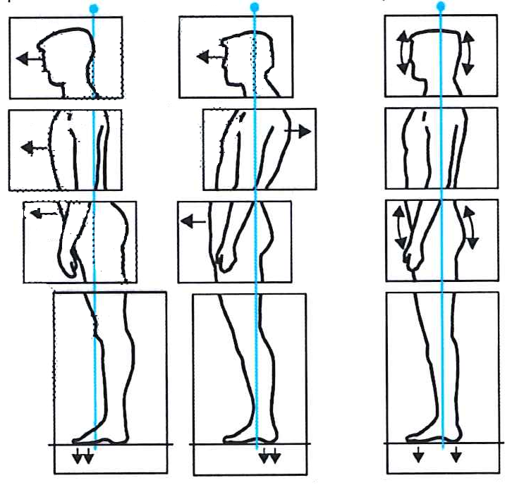
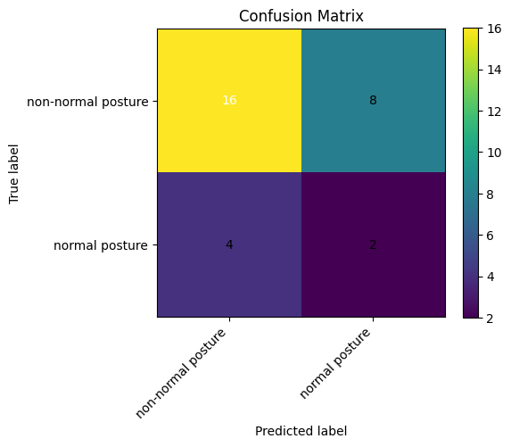
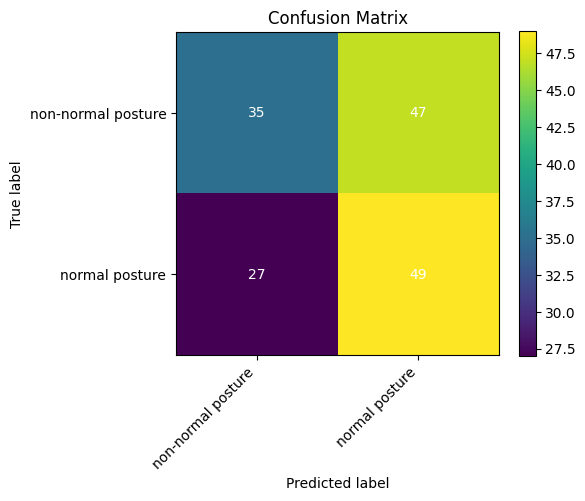
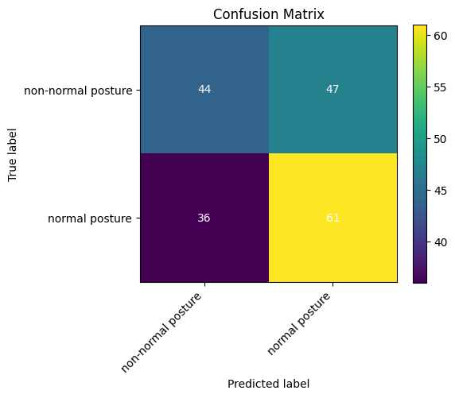
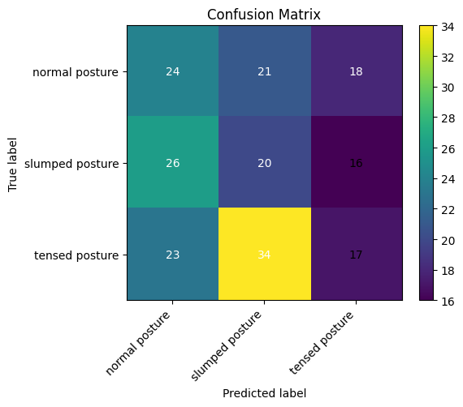
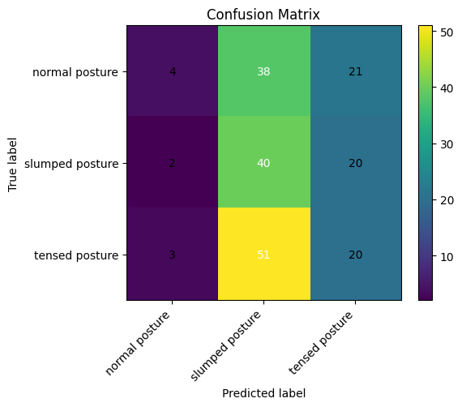
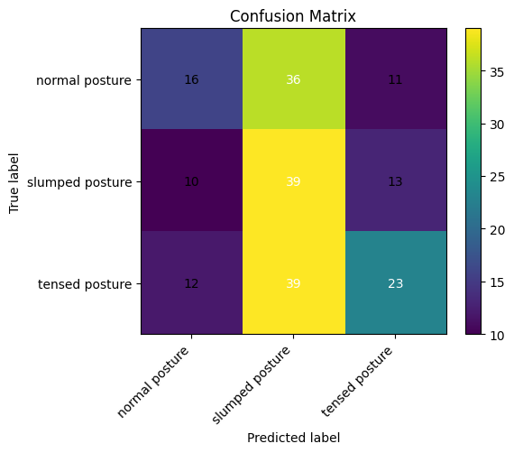
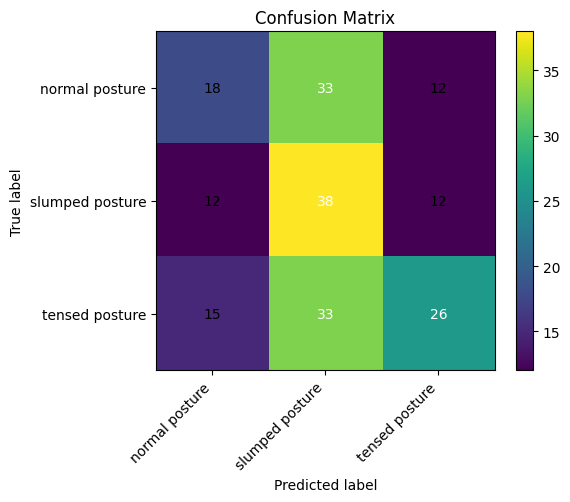
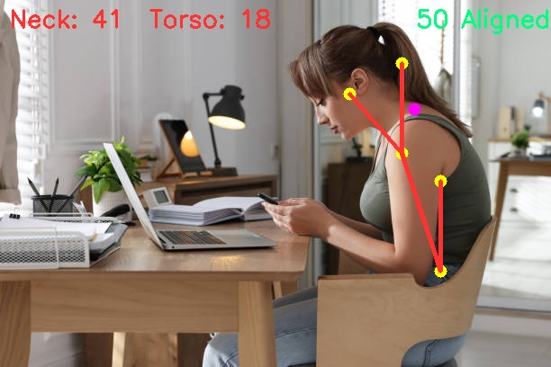

# Contribution

The development of this dissertation incorporated the selective use of generative artificial intelligence (AI) tools as supportive research and technical assistance instruments. GitHub GitHub Copilot and Posit Assistant were utilized to assist in troubleshooting Python dependency conflicts, resolving CI/CD configuration issues involving Jenkins and Docker, and supporting administrative setup tasks related to RStudio Server. In addition, Perplexity was used for targeted literature discovery and contextual identification of relevant academic sources and references. All critical analysis, interpretation, methodological decisions, and written academic content were independently evaluated, verified, and finalized by the author.

Also, I received guidance and support from my two supervisor, Dr. Syed Ahmar Shah and John Wilson, who gave me many recommendations during the whole process to conduct the project as well reviewed the draft of the paper once and gave me valuable feedback.

\clearpage

# **Abstract**

## Aim & objectives

Finetuning and evaluation of a deep learning model for posture and movement quality assessment that detects and interprets imbalances in the head, neck torso to finetune an pre-trained Google MediaPipe image classification model for posture and movement imbalance detection; and to evaluate the performance of the finetuned classification model.

## Design

Quantitative, observational secondary data analysis evaluating transfer learning on lightweight convolutional neural networks (CNNs) within the Google MediaPipe/TensorFlow Lite ecosystem for static posture classification. Through comparing multiple compact model architectures and deployment-friendly pipelines to assess feasibility for low-cost, on-device, low-latency clinical screening. Model performance is measured on a test set to gauge discrimination across three posture classes and also a binary reformulation of the training was conducted.

## Methods

A curated Kaggle side‑view posture image set (n=300) was manually labelled into three classes (normal, slumped, tensed) and expanded via deterministic augmentation to yield around 1900 training images with validation/test splits. Transfer learning fine‑tuned classification layers on EfficientNet‑Lite0/2/4 and MobileNet‑V2 backbones; preprocessing included resizing/normalization and clinically conservative augmentations (small rotations/crops, brightness/contrast jitter, keypoint overlays). Models were exported fully as well as quantized TFLite artifacts and evaluated using accuracy, precision, recall, F1, confusion matrices, and balanced accuracy. A binary “normal vs non‑normal” task was also trained to probe clinical interpretability and potential performance gains.

## Results

Across the two-class experiments, the binary classification task achieved a balanced accuracy of 0.552 (with landmark overlays) and 0.536 (without overlays), compared to a 0.50 chance level.

Reformulating as a three-class experiement the EfficientNet‑Lite4 model architecture achieved the highest balanced test accuracy (**41.7%**), followed by EfficientNet‑Lite2 (**39.8%**). Confusion patterns showed over‑prediction of “slumped” and frequent misclassification of “normal,” consistent with class overlap and subtle boundary cases. This approach indicates modest gains (0.33 chance level) and clearer clinical framing, though still below targets for deployment.

## Conclusion

Transfer learning on compact CNNs within the MediaPipe/TFLite stack is feasible for posture imbalance screening, but current performance is limited by small sample size, class ambiguity, and domain subtlety. Targeted data growth (especially boundary and “normal” exemplars), refined labels, posture‑aware augmentation, calibration/thresholding, and fairness checks are recommended. With these improvements and expanded validation, a lightweight, on‑device tool could support objective posture assessment alongside clinical judgement.

\clearpage

# Introduction

Healthcare is increasingly recognizing the importance of movement quality and postural balance in preventing injury, managing chronic conditions, and optimizing physical performance [@Whittaker2017]. @Wijekulasuriya2025 found in an extensive actual meta analysis that traditional methods for assessing posture and movement often rely on subjective clinical observations, limiting their accessibility and consistency. Advances in artificial intelligence (AI) and computer vision offer promising avenues for developing such objective tools that are scalable and run on consumer hardware that is widely available [@Google2024; @Bazarevsky2020]. This dissertation explores the development of Convolutional Neural Networks (CNNs) through transfer learning within the Google MediaPipe framework to detect and analyze head-neck-torso alignment.

Human posture and coordination are central to both health and performance. Impairments such as muscular tension, poor motor control, or postural imbalance contribute significantly to discomfort, injury, and reduced physical performance in daily and professional life [@Kubalek-Schrder2013]. Advanced motor skills rely on precise kinaesthetic differentiation, including fine motor control, proprioceptive sensitivity, accurate force regulation, coordinated timing, and the economy of movement. These elements form the basis of effective movement in sports, rehabilitation, and everyday function [@ZauckerP2010]. Recent research highlights that chronic low back pain and other movement system impairments are closely associated with sustained postural deviations and maladaptive movement patterns that often develop gradually and may not be apparent during isolated clinical assessments [@Sahrmann2017; @Ge2022].

Traditional approaches to assessing posture and coordination rely on subjective evaluations, clinical observation, expensive motion analysis systems, or extensive practitioner expertise. While commercial software for posture assessment exists, these solutions often require professional oversight and remain limited in their ability to capture subtle or habitual patterns of imbalance consistently [@Badhe2018]. This highlights a clear gap between the qualitative nature of clinical assessments and the potential for more objective, data-driven methods enabled by modern machine learning techniques.

Recent advances in computer vision and artificial intelligence provide opportunities to bridge these limitations. Convolutional Neural Networks (CNNs) have demonstrated high accuracy in identifying patterns within image and video data and are increasingly applied in gait analysis, posture detection, and motion tracking [@Jiang2023]. Among available frameworks, the Google MediaPipe framework brings a lightweight approach that can be run in the browser or on mobile devices, utilizing a statistical 3D human shape modelling pipeline offered as a trainable and modular deep learning framework. It can accurately represent full-body details to detect pose and posture [@Xu2020; @Bazarevsky2020].

As a physiotherapist with focus on movement quality, I found these gaps were not purely academic but deeply practical in my clinical practice. To reach a level of good understanding of movement (patterns) it required years of training and clinical experience to develop. For instance the ability to accurately assess the quality of movement based on key indicators such as the passive rotatory mobility of the fifth thoracic vertebra (Th5) and adjacent vertebrae [@Tachihara2019]. The possibility of using lightweight computer vision to complement clinical expertise, enhance rehabilitation outcomes, and support performance improvement is therefore highly compelling.

## **Research question**

How can transfer learning on a pre-existing TensorFlow Lite model for pose estimation and image classification be used to detect and analyze posture and movement imbalances?

## Aim

Finetuning and evaluation of a deep learning model for posture and movement quality assessment that detects and interprets imbalances in the head, neck torso and to make it suitable for the clinical context.

## Objectives

1.  To finetune an pre-trained Google MediaPipe image classification model for posture and movement imbalance classification.
2.  To evaluate the performance of the finetuned classification model.

## Dissertation structure

The present work is structured as follows:

The abstract formulates the research question, aim, objectives, and provides a concise summary of the design, methods, results, and conclusions. Where as the introduction outlines the background, rationale, and research question, and defines the aim and objectives of the project.

The "Literature Review" chapter provides a comprehensive literature review of the current state of AI-based posture and movement analysis, with a focus on the capabilities and limitations of existing pose estimation frameworks such as Google MediaPipe.

The "Methodology" chapter outlines the methods used, including the study design, data sources, variable definitions, model development approach, and performance evaluation strategy.

The "Implementation" chapter details the implementation of the training and inference pipelines with a complex CD/CI integration.

The "Result" chapter presents the results of model performance and error analysis and shows the challenges of training a custom CNN model.

The "Discussion" chapter addresses the findings in relation to existing literature, strengths and limitations, and clinical implications.

The "Conclusion" chapter outlines the expected impact and dissemination plans, while

Whereby the final chapter concludes with a summary of contributions and future work directions.

\clearpage

# Literature Review

Recent validation studies comparing MediaPipe with gold-standard motion capture systems reveal measurable discrepancies in landmark accuracy, particularly for subtle postural features, highlighting the need for domain-specific refinement for clinical use [@Kakuta2022]. Here, "subtle" means inappropriate muscular tension with small or no movement of (the) body(-parts). More broadly, current pose estimation models remain limited by sensitivity to noise and 2D–3D estimation gaps, reducing their reliability for detecting the named tensions and asymmetries critical to movement and pose imbalance analysis [@Kakuta2022; @Lachance2023]. Fairness and representativeness in pose estimation systems are also important concerns: current Pose Estimation Models (PEMs) exhibit performance disparities across demographic groups, with reduced accuracy for under-represented populations in training datasets [@Lachance2023]. Available datasets frequently focus on male and predominantly white participants between the ages of 19 and 50, while under-representing females, older adults, and individuals with darker skin tones, thereby increasing the risk of systematic bias and reduced generalizability in movement and posture analysis.”

Consequently, while MediaPipe Pose serves as a robust foundation for pose detection, in its standard configuration of training it does not inherently capture the fine-grained symmetry metrics, sagittal and coronal balance indicators, or compensatory movement patterns that rely on hyper- and hypo-tension that are essential for clinical postural and even more for movement analysis. Computer-vision-based deep learning markerless systems nonetheless represent an important step towards closing the gap between theoretical research, that can be even a century old like the principle of primary control of human movement by @AlexanderFM2017, and practical implementation in remote clinical assessment [@Wagh2024; @UltralyticsInc2025].

This project uses transfer learning [@Kakuta2022] to adapt a pre-trained Google MediaPipe CNN model, originally trained on extensive image data, to a new small Kaggle dataset but with more relevant and higher-quality images for posture imbalance detection. By utilizing pre-learned feature representations, the model can achieve faster convergence and improved accuracy even with a comparatively smaller or domain-specific dataset.

## Market research

Modern video analysis with the purpose of detecting pose, movement, and specific markers in sports activities has undergone a paradigm shift, moving from subjective clinical intuition to high-fidelity, data-driven kinematic quantification. Commercial ecosystems like @MAR-Systems-Ltd2026 leverage dual-camera 3D reconstruction to analyze over 40 biomechanical metrics without intrusive markers, targeting retail efficiency and rapid, evidence-based footwear recommendations. Similarly, @RunDNA2026 employs advanced motion capture to track kinetic and kinematic variables from foot strike to toe-off, providing practitioners with a granular, 3D anatomical breakdown of movement asymmetries. For integrated clinical environments, the @Medical-XPRT2026 combines 3D camera technology with a sensorized, load-cell-equipped treadmill to provide real-time biofeedback and synchronized gait analysis. Supplementing these laboratory-grade tools, @Running-Reborn-20262026 utilizes wearable inertial measurement units (IMUs) to provide continuous, longitudinal monitoring of temporal outcomes like ground contact time and cadence, albeit with sensitivity to speed-dependent discrepancies. At the vanguard of performance capture, @Move-AI-Ltd2026 offers sophisticated, markerless motion capture solutions that utilize computer vision to extract high-fidelity skeletal data from multi-camera footage, facilitating biomechanical analysis outside of traditional studio settings.

The overarching advantage of these commercial approaches lies in their ability to translate complex, high-frequency spatial-temporal data into actionable clinical diagnostics. They reduce inter-rater variability, the differences between multiple assessors, and enable objective longitudinal tracking. Such standardization of classification, may improve the reliability of qualitative (and quantitative) movement assessments in evidence-based rehabilitation settings. Conversely, the disadvantages often involve high capital expenditure, the requirement for controlled capture environments, and often a reliance on proprietary pipelines that can be difficult to consistently integrate into existing clinical (analytical) workflows.

When evaluated against image classification models, the advantages of the latter become apparent: low-cost, low-latency identification of specific postural states and movement patterns, albeit at the expense of the quantitative kinematic precision provided by advanced motion-capture and biomechanical analysis systems.

## Current Research on Convolutional Neural Networks

@Cao2024 state that human posture recognition are machine extractions simulating the eye-function and human learning via feature extraction. They divide this recognition into static and dynamic posture detection, whereby latter one extracts continuous frame sequences and this more widely used. Using images for training and for inference, this approach is static posture classification.

## Summary

Lore Ypsum placeholder text: This section will conclude the literature review in a concise way.

\clearpage

# Methodology

In this work, a quantitative observational design is applied to explore the feasibility of using transfer learning on a pre-trained TensorFlow Lite model for posture and movement imbalance detection. The study involves secondary analysis of an existing image dataset curated for posture assessment, with a particular focus on evaluating the performance of a fine-tuned CNN model within the Google MediaPipe framework. This technology was selected because it provides a reproducible and cross-platform environment for rapid prototyping, model deployment, and iterative optimization of computer-vision applications, while enabling efficient integration of pre-existing perception components and consistent performance evaluation across different devices and platforms [@Lugaresi2019].

## Study design and setting

This study is a secondary data analysis exploring postural and movement imbalance detection using artificial intelligence. The project applies a quantitative, observational design, analyzing existing image data through supervised machine learning, specifically Convolutional Neural Networks (CNNs) implemented via TensorFlow Lite within the Google MediaPipe framework. The aim is to evaluate whether lightweight AI models can detect subtle patterns of imbalance in posture and coordination and to adapt them for potential clinical use through transfer learning on a posture-specific dataset.

The study will be conducted remotely using a secondary dataset. All data analysis will be performed on secured infrastructure provided by the author (see Implementation). No new data collection or participant interaction is planned.

## Data source and characteristics

This study uses secondary image data of an openly available "Posture Keypoints Detection – Photos & Labels" dataset on Kaggle. The dataset consists of 300 images in static side view with image resolutions of up to around 1.6 MP and an overall high quality look.

Unlike large-scale, general-purpose image datasets, this Kaggle dataset is specifically curated for posture analysis. It focuses on side-view images suitable for assessing sagittal-plane alignment and upper-body posture. The relatively small dataset size and potential demographic limitations may constrain generalizability and fairness.

## Variables, features, and preprocessing

The posture classification follows 3 types of poses regarding posture classifications by @Klein-Vogelbach1990 as you see in the following illustration:



**The classes**

- "tensed posture" (left)
- "slumped posture" (middle)
- "normal posture" (right)

The author manually annotated and assigned the 300 images to one of these classes according to his clinical experience in the field of orthopedics and functional movement therapy. In the initial annotation round, the dataset was artificially balanced by assigning 100 images to each class (normal, slumped, and tensed posture). While this ensured equal class distribution for training, it also introduced ambiguous and potentially misclassified samples near class boundaries. Therefore, a second annotation and training run was conducted using a slightly imbalanced but clinically more consistent class distribution, resulting in improved class separation and overall classification performance.

**Primary outcome**

- **Head-neck-torso alignment:** Angular relationships and relative positioning of the head, cervical spine, and torso regarding the 3-class model by Klein-Vogelbach will lead towards model classification
  - normal posture
  - slumped posture
  - tensed posture

**Exposures/independent variables**

- **Image category/context:** Static posture images in standardized side view.
- **Camera/view angle:** Minor variation in pose estimation accuracy depending on exact lateral positioning.

**Covariates/control features**

- **Image characteristics:** Resolution, background, and lighting, which may influence model performance.
- **Posture variation:** Degree of anterior head translation, kyphosis, and other sagittal-plane deviations.

**Extracted features**

- **Skeletal keypoints:** Annotated landmarks in YOLO pose format and MediaPipe Pose outputs.
- **Kinematic proxies:** Angular relationships between key joints and segments.
- **Postural imbalance markers:** Anterior head translation, sagittal imbalance, and deviations from expected alignment patterns.

All selected images from the Kaggle dataset undergo data augmentation (e.g., small rotations, cropping, brightness adjustments) to increase sample size and improve generalization while preserving clinically meaningful posture characteristics.

## Model development and transfer learning

This study employs a transfer learning approach to develop a domain-specific TensorFlow Lite model suitable for clinical posture and movement analysis. Transfer learning enables the adaptation of pre-trained CNN architectures—such as those used within MediaPipe and trained on large-scale datasets like ImageNet—to the focused task of detecting head-neck-torso imbalances. In practice, base model weights are kept frozen or partially frozen, while classification and selected high-level layers are retrained using the Kaggle posture dataset.

Deploying the resulting model as a quantized TensorFlow Lite artifact supports real-time, on-device inference on mobile and edge devices, reducing latency and preserving user privacy by processing data locally.

## Analysis and performance evaluation

The analysis will proceed in two phases:

1.  Descriptive analysis of dataset composition, annotation completeness, and posture-related metrics.
2.  AI-based classification and pattern recognition using transfer learning and supervised deep learning methods.

Model performance will be evaluated using accuracy as the primary metric and, where feasible, precision, recall, F1-score, and confusion matrices. Robustness and generalization will be explored through limited distribution-shift experiments (e.g., withheld images with slight background or lighting variation). All hyperparameters, data splits, and preprocessing steps will be documented to ensure reproducibility.

\clearpage

# Implementation

To utilize the Google MediaPipe framework, extended pipelines and automation were used to prepare the data, train and evaluate models, and produce deployable inference artifacts. The research environment and reproducible steps to build the training pipeline and maintain a production ready data-engineering workflow (including the n8n augmentation workflow) are described.

## Research setup

- **Hardware and runtime**

  The development was mostly performed on a remote virtual machine with Ubuntu Linux and specs of 8GB RAM and 4 available CPU Cores. For editing Python scripts, a Jupyter Notebook was used for editing and running the transfer-learning script, for editing the Quarto dissertation project file a RStudio Server. Next to this, a Streamlit WebApp was developed and used to test re-trained models manually. Both the Jupyter notebook and the Streamlit WebApp were deployed via a Docker container on the remote server to manage heavy Python library dependencies of MediaPipe Model Maker (Python 3.10) respective of MediaPipe / TensorFlow Lite (Python 3.13) for the Streamlit app.

- **Software/framework/service stack**

  - Python 3.10 (Model Maker) or Python 3.13 (Inference)
  - Core CNN libraries: MediaPipe Pose (0.10.20), MediaPipe Model Maker (0.2.1.3), TensorFlow 2.19.1 with TFLite support and Keras (3.12.1)
  - Important Python-libraries: OpenCV, NumPy, pandas, Matplotlib, FastAPI (for MediaPipe API), Streamlit (for WebApp)
  - Jupyter notebook
  - Quarto
  - Streamlit (Python WebApp)
  - Docker
  - Jenkins (CI server)
  - n8n (automation/workflows)
  - GitHub Actions (dissertation artifact build and deployment)

- **Environment manifests used in this project (congested by Dockerfiles)**

  - `code/environment.yml`
  - `code/environment_model-maker.yml`
  - `code/requirements.txt`
  - `code/requirements_model-maker.txt`

- **Example reproducible local environment:**

``` bash
# MediaPipe Model Maker environment
conda env create -f code/environment_model-maker.yml
conda activate dissertation-3.10

# MediaPipe Pose and TensorFlow Lite environment
conda env create -f code/environment.yml
conda activate dissertation-3.13
```

## Training pipeline and data engineering

Overview - The training pipeline follows an ETL pattern: ingest → validate → augment → split → train → evaluate → archive. Steps are implemented in the repository as Jupyter notebooks and scripts to allow both interactive experimentation and non-interactive CI execution.

Automated augmentation (n8n + MediaPipe) - To expand the original 300 images, the repository uses an n8n workflow to produce duplicates with MediaPipe keypoint overlays and controlled image edits (rotations, crops, brightness adjustments). - The exported n8n workflow is available at `code/n8n/Dissertation_Posture_Analysis.json`. The high-level workflow:

1.  Read a list of source images (the initial 300).

2.  For each image, call a MediaPipe inference endpoint (either the containerized `code/mediapipe_pose.py` service or an HTTP MediaPipe API) using an `HTTP Request` node.

3.  Receive keypoint coordinates and render overlay images server-side (via the MediaPipe container or a rendering script).

4.  Save augmented images to `data/` and record augmentation metadata (source id, parameters).

5.  Optionally trigger a downstream training job (Jenkins) or commit augmented data back to the repository index. - This decoupled approach produces auditable augmentation runs and keeps augmentation reproducible.

Training execution - Training can be run locally via `custom_image_classifier_model_training.ipynb` or (remote) inside a container built from `code/Dockerfile` served as Juypter notebook.

Augmentation & split policy - Augmentations used: small rotations (±10°), random crops (±10%), brightness/contrast jitter, and MediaPipe keypoint overlays. Horizontal flips are used when anatomically appropriate. - Splits are deterministic and saved to `data/splits/` for reproducibility.

Artifacts and model storage - Model artifacts (.h5 and .tflite), logs and run figures are stored under `data/models/` and `runs/`. Each run directory includes metadata (git commit, config checksum, timestamp).

## Inference pipeline, containerization and CI/CD

Inference packaging - Inference scripts live in `scripts/` (for example `custom_tflite_image_classifier.py` and `custom_tflite_pose.py`) and operate against quantized `.tflite` models exported to `data/models/`. - Local inference example:

``` bash
python scripts/custom_tflite_image_classifier.py --model data/models/<run>/model.tflite --image data/images/example.jpg
```

**Containerization and compose**

- The project maintains two primary Dockerfile artifacts:

- `code/Dockerfile` — training and utilities image.

- `code/Dockerfile_mediapipe`

MediaPipe runtime used for keypoint extraction and overlay rendering. Multi-service development is defined in:

- `code/docker-compose.yml`

- Start development services:

``` bash
docker compose -f code/docker-compose.yml up --build
```

**CI/CD**

Jenkins is used for build a Jupyter environment on a server to run model training and also builds a Streamlit WebApp for inference testing of previously build models.

GitHub Actions of a GitHub Pages repository is trigged to render the Quarto artifacts:

- Checkout repository - Installs Quarto and LaTeX (for PDF rendering).
- Deploys the dissertation project as HTML on <https://drbenjamin.github.io/dissertation.html>

**Automation orchestration** (n8n)

`A n8n` server run as a containerized service (two container) and to hosts the augmentation workflows. Responsibilities:

- n8n instance (container one)
- Orchestrate MediaPipe API (container two) calls and rendering.
- Persist augmented images and artifacts on a MinIO file storage.


\clearpage

# Results

Results were measured for seven model training in total. Three for 2-class and 4 for 3-class image input datasets.

## Dataset and preprocessing outcomes

The dataset and splits used across all runs were consistent. The training set contained 300 original images distributed across two or three classes. To increase the number from 300 original images to counts of \~1500 or \~1800, different augmentation techniques were applied.

- First, the images were duplicated several times and processed via random image editing utilizing the OpenCV framework. For instance, the color-theme or background color were changed, images were cropped or tilted. For each augmented image, 2 changes were applied.

- Second, a subset of duplicated 300 images with body landmarks as overlay were added to specific runs. This was achieved by an existing MediaPipe Pose model which was adding these annotations.

Preprocessing was applied consistently for all runs (same processed image data set) to maintain comparability between 2/3 class runs and architectures.

## 2-Class Training

The objective is to reach an accuracy of approximately 80–90%, which is generally considered strong performance for practical detection tasks in applied machine learning settings and for the Google MediaPipe model architecture. Therefore, the images will be annotated into normal and non-normal to define 2 classes.

### Model performance - 2-class problem

The same base dataset was used for all three training runs. To address class imbalance in run 2 and 3, data augmentation was applied with an 8× multiplication for normal posture images and a 4× multiplication for non-normal posture images, resulting in a balanced dataset of 1,580 synthetically augmented images.

The third run was extended by an additional 300 images, which were augmented using body landmark overlays generated with the Google MediaPipe Pose framework to incorporate explicit skeletal structure information, which lead to a total of 1880 images.

#### Training 1

[Prediction-derived overall accuracy:]{.underline} 0.6000

[Model evaluate() loss/accuracy on dataset_obj:]{.underline} 0.546806/0.733333

**Confusion matrix (rows=true, cols=pred)**

| True predicted | non-normal | normal |
|---------------:|-----------:|-------:|
|     non-normal |         16 |      8 |
|         normal |          4 |      2 |

**Row-normalized confusion matrix (recall by class)**

| True predicted | non-normal | normal |
|---------------:|-----------:|-------:|
|     non-normal |     0.6667 | 0.3333 |
|         normal |     0.6667 | 0.3333 |

[Per-class support:]{.underline}

- non-normal posture: 24
- normal posture: 6

[Balanced accuracy (macro recall):]{.underline} **0.5000**

**Classification report**

| Class              | Precision |     Recall | F1-score | Support |
|--------------------|----------:|-----------:|---------:|--------:|
| non-normal posture |    0.8000 |     0.6667 |   0.7273 |      24 |
| normal posture     |    0.2000 |     0.3333 |   0.2500 |       6 |
| **Accuracy**       |           |            |   0.6000 |      30 |
| **macro avg**      |    0.5000 | **0.5000** |   0.4886 |      30 |
| **weighted avg**   |    0.6800 |     0.6000 |   0.6318 |      30 |



#### Training 2

[Prediction-derived overall accuracy:]{.underline} 0.5316

[Model evaluate() loss/accuracy on dataset_obj:]{.underline} 0.421809/0.854430

**Confusion matrix (rows=true, cols=pred)**

| True predicted | non-normal | normal |
|---------------:|-----------:|-------:|
|     non-normal |         35 |     47 |
|         normal |         27 |     49 |

**Row-normalized confusion matrix (recall by class)**

| True predicted | non-normal | normal |
|---------------:|-----------:|-------:|
|     non-normal |     0.4268 | 0.5732 |
|         normal |     0.3553 | 0.6447 |

[Per-class support:]{.underline}

- non-normal posture: 82
- normal posture: 76

[Balanced accuracy (macro recall):]{.underline} **0.5358**

**Classification report**

| Class              | Precision |     Recall | F1-score | Support |
|--------------------|----------:|-----------:|---------:|--------:|
| non-normal posture |    0.5645 |     0.4268 |   0.4861 |      82 |
| normal posture     |    0.5104 |     0.6447 |   0.5698 |      76 |
| **Accuracy**       |           |            |   0.5316 |     158 |
| **macro avg**      |    0.5375 | **0.5358** |   0.5279 |     158 |
| **weighted avg**   |    0.5385 |     0.5316 |   0.5264 |     158 |



#### Training 3 (extra body landmark overlay)

[Prediction-derived overall accuracy:]{.underline} 0.5585

[Model evaluate() loss/accuracy on dataset_obj:]{.underline} 0.454466/0.840426

**Confusion matrix (rows=true, cols=pred)**

| True predicted | non-normal | normal |
|---------------:|-----------:|-------:|
|     non-normal |         44 |     47 |
|         normal |         36 |     61 |

**Row-normalized confusion matrix (recall by class)**

| True predicted | non-normal | normal |
|---------------:|-----------:|-------:|
|     non-normal |     0.4835 | 0.5165 |
|         normal |     0.3711 | 0.6289 |

[Per-class support:]{.underline}

- non-normal posture: 91
- normal posture: 97

[Balanced accuracy (macro recall):]{.underline} **0.5562**

**Classification report**

| Class              | Precision |     Recall | F1-score | Support |
|--------------------|----------:|-----------:|---------:|--------:|
| non-normal posture |    0.5500 |     0.4835 |   0.5146 |      91 |
| normal posture     |    0.5648 |     0.6289 |   0.5951 |      97 |
| **Accuracy**       |           |            |   0.5585 |     188 |
| **macro avg**      |    0.5574 | **0.5562** |   0.5549 |     188 |
| **weighted avg**   |    0.5576 |     0.5585 |   0.5562 |     188 |



### Error analysis

**Training run 1** achieves the highest accuracy of 0.6000. The confusion matrix using the test-image subset shows that performance is uneven across classes: out of 24 non-normal posture cases, 16 are correctly classified and 8 are misclassified as normal, resulting in a recall of 0.6667. In contrast, only 2 out of 6 normal posture cases are correctly identified, while 4 are misclassified as non-normal, yielding a recall of 0.3333. This indicates a clear bias towards correctly predicting non-normal posture while under-detecting normal posture.

As the normal posture class contains only 6 test images, the recall estimate for this class is highly sensitive to single misclassifications and therefore unstable. Consequently, using accuracy as the primary performance indicator is misleading due to both the small sample size and the strong class-wise imbalance. Therefore, **balanced accuracy (macro recall)** is introduced as the primary evaluation metric, which is **0.5000**, as it assigns equal weight to each class and directly reflects class-wise sensitivity (recall), providing a more reliable assessment of model performance across posture categories. Secondly two annotation strategies to increase the total number of images are used for following runs:

- **noise:** Several OpenCV image processing routines where applied to multiply the original 300 images to changed duplicates. Techniques used are:

  - Random flip (Horizontal or vertical flipping)

  - Affine transform (Rotating, scaling, translating, and shearing)

  - Random crop + resize (Cropping a random window then resizing back to original size)

  - HSV jitter (Random hue, saturation, and value shifts in HSV space)

  - Intensity adjust (Changing contrast/brightness)

  - Gaussian noise (Additive Gaussian noise per pixel)

  - Random erasing (Erasing a random rectangle region)

- **overlay:** With a pre-trained Google MediaPipe Pose model, which estimates 33 body landmarks to create a skeletal pose representation, the original 300 images were processed into augmented copies with landmark overlays and color coding (white/red) to indicate posture angles and quality (see Fig. A1).

**Training run 2** with no overlays but total 1500 images after annotation, achieves an accuracy of 0.5316 and a balanced accuracy of **0.5358**, slightly higher than the first Training run with only 300. The confusion matrix shows an uneven class-wise performance: out of 82 **non-normal posture** cases, 35 are correctly classified as non-normal, while 47 are misclassified as normal, resulting in a recall of 0.4268. In contrast, out of 76 **normal posture** cases, 49 are correctly identified, while 27 are misclassified as non-normal, yielding a recall of 0.6447.

**Training run 3** with additional landmark overlay images (\>1800 images) achieves an accuracy of 0.5585 and a balanced accuracy of **0.5562**. Compared to run 2, class-wise performance becomes more balanced: recall for non-normal cases decreases slightly, while recall for normal cases increases, reducing the class imbalance in sensitivity. This indicates that landmark overlays shift the decision boundary towards improved representation of the minority class, resulting in a more even distribution of classification errors across classes.

Overall, both ladder models still perform only marginally above the 50% chance level, but the overlay-based model provides a measurable improvement in class-balanced performance rather than accuracy alone.

## 3-Class Training

To achieve the pose detection defined by Klein-Vogelbach, 3 classes have to be defined:

- normal posture

- slumped posture

- tensed posture

These classes represent distinct qualitative posture states used in clinical movement analysis. The **normal posture** class represents an aligned and functionally efficient baseline posture. The **slumped posture** class captures flexed, collapsed, or reduced postural tone patterns, typically associated with decreased axial extension. The **tensed posture** class represents increased muscular tone and excessive postural rigidity, often reflected in elevated shoulder girdle and reduced movement fluidity in the spine and hips.

This three-class formulation enables the CNN to distinguish between physiologically neutral, hypoactive (slumped), and hyperactive (tensed) postural states, aligning the computational labels with clinically meaningful categories from the Klein-Vogelbach framework.

### Model performance - 3-class problem

For the 3-class problem, in total four training runs were performed using all four available base architectures (from light to heavy computational wise):

- \`MobileNet-V2\`

- \`EfficientNet-Lite0\`

- \`EfficientNet-Lite2\`

- \`EfficientNet-Lite4\`

For each run the reported metrics below are derived from evaluation on the same held-out on the test split.

#### Training 1 (MobileNet-V2 architecture)

[Prediction-derived overall accuracy:]{.underline} 0.3065

[Model evaluate(internal performance metric) loss/accuracy on dataset_obj:]{.underline} 0.736599/0.748744

**Confusion matrix**

| True predicted | normal | slumped | tensed |
|----------------|-------:|--------:|-------:|
| normal         |     24 |      21 |     18 |
| slumped        |     26 |      20 |     16 |
| tensed         |     23 |      34 |     17 |

**Row-normalized confusion matrix (recall by class)**

| True predicted | normal | slumped | tensed |
|----------------|-------:|--------:|-------:|
| normal         | 0.3810 |  0.3333 | 0.2857 |
| slumped        | 0.4194 |  0.3226 | 0.2581 |
| tensed         | 0.3108 |  0.4595 | 0.2297 |

[Per-class support:]{.underline}

- normal posture: 63
- slumped posture: 62
- tensed posture: 74

[Balanced accuracy (macro recall):]{.underline} **0.3111**

**Classification report**

| Class             | Precision |     Recall | F1-score | Support |
|-------------------|----------:|-----------:|---------:|--------:|
| normal posture    |    0.3288 |     0.3810 |   0.3529 |      63 |
| slumped posture   |    0.2667 |     0.3226 |   0.2920 |      62 |
| tensed posture    |    0.3333 |     0.2297 |   0.2720 |      74 |
| **Accuracy**      |           |            |   0.3065 |     199 |
| **Macro avg.**    |    0.3096 | **0.3111** |   0.3056 |     199 |
| **Weighted avg.** |    0.3111 |     0.3065 |   0.3038 |     199 |



#### Training 2 (EfficientNet-Lite0 architecture)

[Prediction-derived overall accuracy:]{.underline} 0.3216

[Model evaluate(internal performance metric) loss/accuracy on dataset_obj:]{.underline} 0.638240/0.824121

**Confusion matrix**

| True predicted | normal | slumped | tensed |
|----------------|-------:|--------:|-------:|
| normal         |      4 |      38 |     21 |
| slumped        |      2 |      40 |     20 |
| tensed         |      3 |      51 |     20 |

**Row-normalized confusion matrix (recall by class)**

| True predicted | normal | slumped | tensed |
|----------------|-------:|--------:|-------:|
| normal         | 0.0635 |  0.6032 | 0.3333 |
| slumped        | 0.0323 |  0.6452 | 0.3226 |
| tensed         | 0.0405 |  0.6892 | 0.2703 |

[Per-class support:]{.underline}

- normal posture: 63
- slumped posture: 62
- tensed posture: 74

[Balanced accuracy (macro recall):]{.underline} **0.3263**

**Classification report**

| Class             | Precision |     Recall | F1-score | Support |
|-------------------|----------:|-----------:|---------:|--------:|
| normal posture    |    0.4444 |     0.0635 |   0.1111 |      63 |
| slumped posture   |    0.3101 |     0.6452 |   0.4188 |      62 |
| tensed posture    |    0.3279 |     0.2703 |   0.2963 |      74 |
| **Accuracy**      |           |            |   0.3216 |     199 |
| **Macro avg.**    |    0.3608 | **0.3263** |   0.2754 |     199 |
| **Weighted avg.** |    0.3592 |     0.3216 |   0.2759 |     199 |



#### Training 3 (EfficientNet-Lite2 architecture)

[Prediction-derived overall accuracy:]{.underline} 0.3920

[Model evaluate(internal performance metric) loss/accuracy on dataset_obj:]{.underline} 0.645087/0.849246

**Confusion matrix**

| True predicted | normal | slumped | tensed |
|----------------|-------:|--------:|-------:|
| normal         |     16 |      36 |     11 |
| slumped        |     10 |      39 |     13 |
| tensed         |     12 |      39 |     23 |

**Row-normalized confusion matrix (recall by class)**

| True predicted | normal | slumped | tensed |
|----------------|-------:|--------:|-------:|
| normal         | 0.2540 |  0.5714 | 0.1746 |
| slumped        | 0.1613 |  0.6290 | 0.2097 |
| tensed         | 0.1622 |  0.5270 | 0.3108 |

[Per-class support:]{.underline}

- normal posture: 63
- slumped posture: 62
- tensed posture: 74

[Balanced accuracy (macro recall):]{.underline} **0.3979**

**Classification report**

| Class             | Precision |     Recall | F1-score | Support |
|-------------------|----------:|-----------:|---------:|--------:|
| normal posture    |    0.4211 |     0.2540 |   0.3168 |      63 |
| slumped posture   |    0.3421 |     0.6290 |   0.4432 |      62 |
| tensed posture    |    0.4894 |     0.3108 |   0.3802 |      74 |
| **Accuracy**      |           |            |   0.3920 |     199 |
| **Macro avg.**    |    0.4175 | **0.3979** |   0.3801 |     199 |
| **Weighted avg.** |    0.4219 |     0.3920 |   0.3797 |     199 |



#### **Training 4 (EfficientNet-Lite4 architecture)**

[Prediction-derived overall accuracy:]{.underline} 0.4121

[Model evaluate(internal performance metric) loss/accuracy on dataset_obj:]{.underline} 0.703537/0.758794

**Confusion matrix**

| True predicted | normal | slumped | tensed |
|----------------|-------:|--------:|-------:|
| normal         |     18 |      33 |     12 |
| slumped        |     12 |      38 |     12 |
| tensed         |     15 |      33 |     26 |

**Row-normalized confusion matrix (recall by class)**

| True predicted | normal | slumped | tensed |
|----------------|-------:|--------:|-------:|
| normal         | 0.2857 |  0.5238 | 0.1905 |
| slumped        | 0.1935 |  0.6129 | 0.1935 |
| tensed         | 0.2027 |  0.4459 | 0.3514 |

[Per-class support:]{.underline}

- normal posture: 63
- slumped posture: 62
- tensed posture: 74

[Balanced accuracy (macro recall):]{.underline} **0.4167**

**Classification report**

| Class             | Precision |     Recall | F1-score | Support |
|-------------------|----------:|-----------:|---------:|--------:|
| normal posture    |    0.4000 |     0.2857 |   0.3333 |      63 |
| slumped posture   |    0.3654 |     0.6129 |   0.4578 |      62 |
| tensed posture    |    0.5200 |     0.3514 |   0.4194 |      74 |
| **Accuracy**      |           |            |   0.4121 |     199 |
| **Macro avg.**    |    0.4285 | **0.4167** |   0.4035 |     199 |
| **Weighted avg.** |    0.4338 |     0.4121 |   0.4041 |     199 |



### Error analysis

Across all experiments a consistent pattern of misclassification is apparent. The models show relatively high recall for the `slumped posture` class but lower precision, indicating a tendency to predict `slumped` for a wide range of inputs. `Normal posture` is frequently misclassified (low recall in several runs), and `tensed posture` predictions vary by architecture: deeper Lite variants tended to improve overall discrimination.

- Best overall accuracy and balanced recall were achieved by EfficientNet-Lite4 (accuracy 0.4121, balanced accuracy **0.4167**).
- EfficientNet-Lite2 performed second best (accuracy 0.3920, balanced accuracy **0.3979**).
- EfficientNet-Lite0 and MobileNet-V2 produced lower overall accuracy (0.3216 and **0.3065** respectively) and lower balanced accuracy.

Common failure modes observed in confusion matrices:

- Confusion between `normal` and `slumped`: many `normal` examples are predicted as `slumped`, suggesting the model is sensitive to subtle postural variations or that the dataset contains ambiguous examples near class boundaries.
- Over-prediction of `slumped`: reflected in row-normalized confusion matrices where the middle column (predicted `slumped`) is large across runs.
- Lower discrimination for `tensed` vs. other classes in the smaller architectures, improved modestly in larger EfficientNet-Lite variants.

#### Comparison of results to 2-class training

Chance levels for the 3-class are 1/3 or 33.3%, for the 2-class 1/2 or 50%. Because of this difference, a chance-balanced accuracy will be calculated.

- Best 3-class model: balanced accuracy =0.4167.

  - κ∗=0.4167−1/31−1/3=0.08340.6667≈0.125κ∗=1−1/30.4167−1/3​=0.66670.0834 ​≈ **0.125**.

- Best 2-class model: balanced accuracy =0.562.

  - κ∗=0.562−0.51−0.5=0.0620.5=0.124κ∗=1−0.50.562−0.5​=0.50.062 = **0.124**.

Adjusted for chance, **3-class** and 2-class models perform essentially on the same performance level. The 3-class model is marginally higher (**0.125** vs 0.124), a difference that’s practically negligible and likely not statistically significant with these sample sizes. In raw terms, binary shows higher accuracy (≈56% vs **41%**), but that’s expected given its higher chance baseline.

\clearpage

# Discussion

This study demonstrates that compact CNNs within the MediaPipe/TFLite stack can learn posture‑relevant features, but current discrimination is limited.

## Interpretation of findings

The strongest three‑class model (EfficientNet‑Lite4) reached 41.2% accuracy (41.7% balanced accuracy). Reformulating the task as binary improved raw accuracy to 55.9% (55.6% balanced) with landmark overlays, indicating that explicit skeletal cues modestly aid detection.To compare the results of the 3-class and 2-class training, we can look at the overall accuracy and balanced accuracy (macro recall) for each model. The 3-class model achieved an overall accuracy of 41.21% and a balanced accuracy of 41.67%, while the 2-class model with landmark overlays achieved an overall accuracy of 55.85% and a balanced accuracy of 55.62%. Also the overall low performances of both CNN model training approaches (2-class as well as 3-class only slightly above chance) suggest that the task is challenging and that further improvements in data quality, model architecture, or training strategy may be needed to achieve clinically useful performance.

Implications and next steps:

- The results indicate that the models can capture some posture-related features but that class overlap and limited dataset size constrain discriminative performance. Better class balance, additional labelled data for edge cases, and further augmentation tailored to posture variations should be considered.
- Model calibration and threshold tuning (or use of ensemble methods) may improve precision for the `slumped` and `tensed` classes.
- Further work should include qualitative review of misclassified examples to identify systematic annotation or dataset issues and targeted augmentation or re-labelling where necessary.

## Strengths and limitations

The strongest three‑class model (EfficientNet‑Lite4) reached 41.2% accuracy (41.7% balanced accuracy). Reformulating the task as binary improved raw accuracy to 55.9% (55.6% balanced) with landmark overlays, indicating that explicit skeletal cues modestly aid detection. However, because the binary chance level is higher (1/2 vs 1/3), these gains largely reflect problem simplification; after accounting for chance, both formulations perform only slightly above baseline. Persistent confusions—especially “normal” misclassified as “slumped”—suggest real class overlap, subtle posture cues, and probable label noise. Given the small dataset and static imagery, these findings point to feasibility rather than readiness for clinical deployment. Priorities for improvement include targeted data growth at class boundaries, refined and possibly multi‑rater labels, posture‑aware augmentation and sampling, and post‑hoc calibration or thresholds to balance sensitivity and specificity for clinically meaningful use.

## Clinical and practical implications

Given current performance (balanced accuracy ≈41% for three‑class), the model’s most appropriate near‑term role is as a clinician‑in‑the‑loop decision support tool rather than a standalone diagnostic. Keeping in mind that n=300, further annotation and data expansion are needed to train the model to a better overall performance. In practice, the system can assist screening by flagging potentially “non‑normal” cases for closer review, standardize documentation via landmark/angle overlays, and track an individual’s progress over time under consistent capture conditions. Safe deployment requires confidence calibration with an “abstain/needs review” state, threshold tuning to the intended use (e.g., sensitivity‑oriented screening), and clear presentation of uncertainty. To enhance reliability and equity, future work should expand and re‑balance labeled data—particularly at class boundaries—adopt multi‑rater labeling, incorporate interpretable posture‑aware features (e.g., craniovertebral angle), and validate externally across sites, devices, and demographic subgroups. On‑device TFLite inference supports privacy and low latency, but any clinical use should be governed by explicit intended‑use documentation, bias and robustness monitoring.

\clearpage

# Conclusion and Future Work

This dissertation demonstrates that transfer learning on compact CNNs within the MediaPipe/TFLite stack is feasible for static upper‑body posture assessment, but current performance does not yet meet clinical decision thresholds. The strongest three‑class model (EfficientNet‑Lite4) achieved 41.2% accuracy (41.7% balanced accuracy). Persistent confusions—particularly over‑prediction of “slumped” and low recall for “normal”—likely reflect subtle class boundaries, label noise, and the small, static dataset. Practically, the present system is best positioned as clinician‑in‑the‑loop decision support for screening, standardized documentation (landmark/angle overlays), and within‑subject progress tracking under a consistent capture protocol. On‑device TFLite supports privacy and low latency, but safe use requires calibrated confidence, explicit uncertainty, and clear guardrails around intended use.

Priorities for future work will center on prospective clinical image collection, expert annotation, improving the MediaPipe Pose detection, develop a 4-body-block detection model (Klein-Vogelbach) as well as retraining the three‑class model to improve discrimination and equity.

## Clinical data collection

To acquire a larger, prospectively collected side-view image dataset in real clinical settings, a strictly standardized acquisition protocol should be implemented, including fixed camera height at approximately shoulder level, constant camera-to-subject distance, standardized lateral stance, neutral footwear, uncluttered background, and controlled, even lighting conditions. Demographic representativeness across relevant population groups should be ensured as well informed consent and ethics approvals should be obtained. In addition, metadata such as device type, viewing angle, and lighting conditions could be systematically recorded to enable reproducibility and avoid bias assessment and ensuring robust model validation.

## Expert annotation

For expert annotation, future work should implement a multi-rater labeling protocol with at least two independent clinicians to ensure annotation reliability, in contrast to the present study where annotations were performed by a single rater (the author). All annotations should follow a clearly defined rubric aligned with the Klein-Vogelbach posture classes (normal, slumped/hypotonic, tensed/hypertonic), including explicit decision criteria to reduce subjective variability. Disagreements between raters should be resolved through a structured adjudication process, ideally involving a third expert reviewer.

Inter-rater agreement should be quantified using metrics such as Cohen’s κ to monitor consistency and identify ambiguous cases. In addition, a stable **gold-standard** subset should be maintained and periodically reused for model calibration and regression testing to ensure annotation quality and temporal consistency across dataset iterations.

## Klein-Vogelbach informed overlay annotation

Instead of 33 body landmarks, a **4-body-block** detection model should be trained. This can lead to overlay-prepared images that represent the posture as a structured higher-level abstraction rather than isolated joint points. By aggregating landmarks into four functional segments (head, thorax, pelvis, and lower extremities), the model can capture inter-segment relationships consistent with Klein-Vogelbach’s posture classification. This enables clearer representation of global postural organisation, such as integrated alignment in normal posture, anterior-posterior dissociation in hypotonic posture, and global anterior load shift in hypertonic posture, thereby improving interpretability and potentially enhancing class discrimination for CNN-based classification.

This could also render the efforts of training the classification model obsolete, as the system would instead be deployed as a pose model that directly estimates the configuration and relative alignment of the four body blocks, allowing posture categories to be derived deterministically from these relationships rather than learned via a separate classification step. But this would also limit the capabilities, as a pose-only model constrains inference to geometric body configurations and therefore reduces the diversity of detectable patterns compared to a classification model, which can learn higher-level, context-dependent and appearance-based cues beyond skeletal alignment, including subtle compensatory strategies and non-linear visual markers that are often relevant in clinical assessment.

## Retraining the 3‑class model

To retrain the model using class-balanced sampling to mitigate class imbalance and apply posture-aware augmentation, boundary cases between normal, slumped, and tensed postures should be carefully handled rather than inadvertently reinforced. Training should incorporate more discriminative and clinically consistent examples, with targeted augmentation that preserves posture semantics while increasing variability in non-ambiguous cases.

In addition, interpretable posture-derived features extracted from landmarks (e.g., craniovertebral angle and thoracic kyphosis proxies) could be integrated to complement image-based learning with clinically meaningful structure. A multi-task architecture, jointly predicting posture class and continuous postural angles, may further improve both classification performance and interpretability by enforcing consistency between categorical and geometric representations of posture. Finally, probability calibration should be applied, and operating thresholds should be explicitly defined for a screening use case to prioritize sensitivity for non-normal postures while controlling false-positive rates.

## Evaluation and fairness

Future work should include external validation on a held-out site or device to assess generalisability beyond the current data source test data-set. In addition, model performance should be reported across relevant subgroups (e.g., sex, age bands, and skin tone), including an analysis of confusion patterns to identify systematic biases or failure modes. Learning-curve analyses should further be conducted to quantify data requirements and inform targeted data collection for improving model robustness and fairness.

## Deployment readiness

For deployment readiness, inference should be performed on-device to ensure low latency and preserve user privacy within the authors E-Health SaaS service *Serious Ben Entertainment* for the German health market, where posture detection is embedded in a digital serious back school game. To enhance reliability in this preventive context, the system should implement confidence gating, allowing the model to abstain or flag cases as “needs review” when prediction certainty is low. In addition, datasets and model versions should be systematically tracked to ensure reproducibility and regulatory transparency. Post-deployment, continuous monitoring for data drift is required, with periodic recalibration to maintain performance as usage conditions, devices, and user populations evolve.

## Milestones

As a concrete milestone, a on-site pilot study should be conducted creating approximately 1,000 newly class-balanced clinical images. Model performance should be evaluated on an external test split, with a target balanced accuracy (three-class, macro recall) in the range of **0.60–0.65** to demonstrate improved generalisability and clinically meaningful classification performance.

Further future work should prioritize the transition to a structured four-body-block pose detection approach aligned with Klein-Vogelbach’s framework. This involves training models to estimate the relative position and orientation of the head, thorax, pelvis, and lower extremities, enabling direct modelling of inter-segment relationships rather than relying on high-dimensional joint inputs. Such an approach may improve robustness and interpretability. Model development should be accompanied by clinically informed annotation protocols and validated against expert-labelled reference data to ensure alignment with functional movement assessment standards.

Last but not least, a dedicated iOS application should be developed to deploy the trained models on Apple’s A-series chip architecture, leveraging the integrated Neural Engine for efficient on-device inference. This would enable real-time posture analysis with low latency, reduced energy consumption, and enhanced privacy through local processing, while also supporting scalable deployment within mobile E-Health and serious gaming applications.

\clearpage

# Appendix A. Figures

**Fig. A1:** Google MediaPipe Pose overlay to show angles of head/neck and torso.



\clearpage

# References
