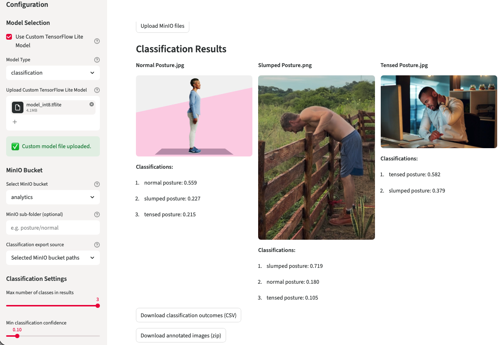
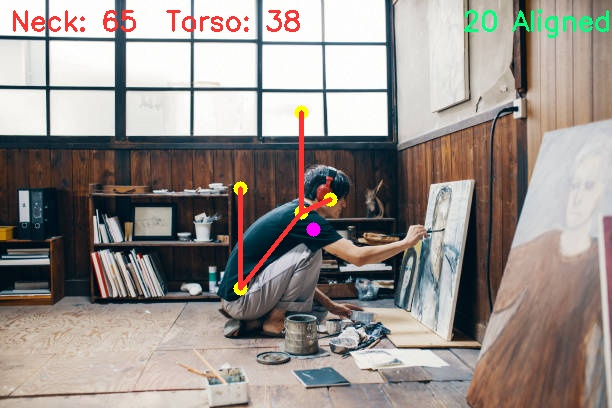

# Contribution {.unnumbered}

The development of this dissertation incorporated the selective use of generative artificial intelligence (AI) tools as supportive research and technical assistance instruments. Github Copilot and Posit Assistant were utilized to assist in troubleshooting Python dependency conflicts, resolving Continuous Integration/Continuous Development configuration issues involving Jenkins and Docker, and supporting administrative setup tasks related to RStudio Server. In addition, Perplexity was used for targeted literature discovery and contextual identification of relevant academic sources and references. DeepL was selectively used as language support tool to translate particular technical terminology from German into English, in cases the the author was not readily knowing it.

All critical analysis, interpretation, methodological decisions, and written academic content were independently evaluated, verified, and finalized by the author. This was achieved through systematic inspection of model outputs, including accuracy, loss trajectories, precision/recall metrics, and confusion matrices across training runs, as well as consistency checks between expected and observed model behaviour.

Also, I received guidance and support from my two supervisor, Dr. Syed Ahmar Shah and John Wilson, who gave me many recommendations during the whole process to conduct the project as well reviewed the draft of the paper once and gave me valuable feedback.

\clearpage

# **Abstract** {.unnumbered}

## Background {.unnumbered}

Postural abnormalities and impaired motor coordination are associated with musculoskeletal disorder, whilst their assessment in clinical practice often relies on subjective observations and the clinician’s expertise. At the same time, increasing pressure on healthcare systems highlights the need for scalable, cost-effective and objective screening tools that can also be used outside highly specialised laboratory settings. Recent advances in deep learning have enabled automated posture and pose analysis. However, existing research focuses predominantly on general pose estimation or biomechanical tracking, whilst comparatively few studies have investigated clinically grounded models for posture classification based on existing physiotherapy frameworks, such as the Klein-Vogelbach concept of normal, curved (hypotonic) and tense (hypertonic) postural patterns. This study therefore investigates whether transfer learning on compact CNN architectures can support practical, cost-effective and device-based posture screening through the classification of clinically relevant postural states.

## Aim & objectives {.unnumbered}

Finetuning and evaluation of a deep learning model for posture and movement quality assessment that detects and interprets imbalances in the head, neck torso to finetune an pre-trained Google MediaPipe image classification model for posture and movement imbalance detection; and to evaluate the performance of the finetuned classification model.

## Methods {.unnumbered}

Quantitative, observational secondary data analysis evaluating transfer learning on lightweight convolutional neural networks using a curated Kaggle image dataset (n=300) according to clinically informed criteria derived from the physiotherapeutic Klein-Vogelbach framework to yield approximately 1,900 training images with validation and test splits. Transfer learning fine‑tuned classification layers on EfficientNet‑Lite0/2/4 and MobileNet‑V2 backbones; preprocessing included resizing/normalization and clinically conservative augmentations. Models were exported fully as well as quantized TFLite artifacts and evaluated using accuracy, precision, recall, F1, confusion matrices, and balanced accuracy. A binary “normal vs non‑normal” task was also trained to probe clinical interpretability and potential performance gains.

## Results {.unnumbered}

Across the two-class experiments, the binary classification task achieved a balanced accuracy of 0.552 (with landmark overlays) and 0.536 (without overlays), compared to a 0.50 chance level.

Reformulating as a three-class experiment the EfficientNet‑Lite4 model architecture achieved the highest balanced test accuracy (**41.7%**), followed by EfficientNet‑Lite2 (**39.8%**). Confusion patterns showed over‑prediction of “slumped” and frequent misclassification of “normal,” consistent with class overlap and subtle boundary cases. This approach indicates modest gains against 0.33 chance level and clearer clinical framing.

## Conclusion {.unnumbered}

Transfer learning on compact convolutional neural networks within the used MediaPipe stack is feasible for posture imbalance screening, but current performance is limited potentially constrained by a small sample size, class ambiguity, and domain subtlety. Therefore targeted data growth (especially boundary and “normal” exemplars), refined labels, posture‑aware augmentation, calibration/thresholding, and fairness checks are recommended.

\clearpage

# Introduction

@Liu2025 states that there is an increasing pressure on healthcare systems through musculoskeletal disorders with projected rise to 2.161 billion people in 2035. Therefore, healthcare is progressively recognizing the importance of movement quality and postural balance in preventing injury, managing chronic conditions, and optimizing physical performance [@Whittaker2017]. @Wijekulasuriya2025 found in an extensive recent meta analysis that traditional methods for assessing posture and movement often rely on subjective clinical observations, limiting their accessibility and consistency. Deep learning and computer vision offer promising avenues for developing such objective tools that are scalable and run on consumer hardware that is widely available [@Google2024; @Bazarevsky2020]. This dissertation explores the development of a deep Learning algorithm for supporting the objective assessment of human posture.

Deep learning is a subset of machine learning based on multi-layered artificial neural networks that learn hierarchical feature representations directly from raw data such as images or motion sequences. Unlike traditional approaches that rely on manually engineered features, deep learning models automatically extract complex, non-linear patterns like edges in images. This enables state-of-the-art performance in domains such as monitoring physical activities of patients . Transfer learning is used to simplify adoption, allowing the reuse of learned visual representations for domain-specific posture classification, extending this paradigm by reusing knowledge from pretrained models. These models often learned from large-scale datasets with wider focus. So, instead of training models from scratch, pretrained networks, for instance image classification or pose estimation models (PEMs) are fine-tuned on domain-specific data such as clinical posture datasets. This significantly reduces data requirements and improves generalization, particularly in settings where labelled clinical data are limited or expensive to obtain [@Ray2024].

This thesis employs a deep learning method—specifically, a transfer learning approach—to develop a resource-efficient, operational system for posture analysis that can run on standard hardware. Pretrained feature extractors are adapted to classify clinically defined posture categories, leveraging prior knowledge from large-scale vision models to compensate for limited domain-specific data. This combination enables a transition from subjective visual assessment toward scalable, data-driven posture evaluation suitable for healthcare screening, rehabilitation, and movement analysis applications.

Human posture and coordination are central to both health and performance. Impairments such as muscular tension, poor motor control, or postural imbalance contribute significantly to discomfort, injury, and reduced physical performance in daily and professional life [@Kubalek-Schrder2013]. Advanced motor skills rely on precise kinaesthetic differentiation, including fine motor control, proprioceptive sensitivity, accurate force regulation, coordinated timing, and the economy of movement. These elements form the basis of effective movement in sports, rehabilitation, and everyday function [@ZauckerP2010]. Recent research highlights that chronic low back pain and other movement system impairments are closely associated with sustained postural deviations and maladaptive movement patterns that often develop gradually and may not be apparent during isolated clinical assessments [@Sahrmann2017; @Ge2022].

Traditional approaches to assessing posture and coordination rely on subjective evaluations, clinical observation, expensive motion analysis systems, or extensive practitioner expertise. While commercial software for posture assessment exists, these solutions often require professional oversight and remain limited in their ability to capture subtle or habitual patterns of imbalance consistently [@Badhe2018]. This highlights a clear gap between the qualitative nature of clinical assessments and the potential for more objective, data-driven methods enabled by modern deep learning techniques.

Recent advances in computer vision and deep learning algorithms provide opportunities to bridge these limitations. Convolutional Neural Networks (CNNs) have demonstrated high accuracy in identifying patterns within image and video data and are increasingly applied in gait analysis, posture detection, and motion tracking [@Jiang2023]. Among available frameworks, the Google MediaPipe framework brings a lightweight approach that can be run in the browser or on mobile devices, utilizing a statistical 3D human shape modelling pipeline offered as a trainable and modular deep learning framework. It can accurately represent full-body details to detect pose and posture [@Xu2020; @Bazarevsky2020].

This project uses transfer learning [@Kakuta2022] to adapt a pre-trained Google MediaPipe CNN model, originally trained on extensive image data, to a new small Kaggle dataset but with more relevant and higher-quality images for posture imbalance detection. By utilizing pre-learned feature representations, the model can achieve faster convergence and improved accuracy even with a comparatively smaller or domain-specific dataset. Overall the selected technology provides a reproducible and cross-platform environment for prototyping and experimenting model development as it integrates pre-existing perception components and offers consistent performance evaluation across different devices and platforms.

As a physiotherapist with focus on movement quality, I found these gaps were not purely academic but deeply practical in my clinical practice. To reach a level of good understanding of movement (patterns) it required years of training and clinical experience to develop. For instance the ability to accurately assess the quality of movement based on key indicators such as the passive rotatory mobility of the fifth thoracic vertebra (Th5) and adjacent vertebrae [@Tachihara2019].

## **Research question**

How can transfer learning on a pre-existing TensorFlow Lite model for pose estimation and image classification be used to detect and analyze posture and movement imbalances?

## Aim

Finetuning and evaluation of a deep learning model for posture and movement quality assessment that detects and interprets imbalances in the head, neck torso and to make it suitable for the clinical context.

## Objectives

1.  To finetune an pre-trained Google MediaPipe image classification model for posture and movement imbalance classification.
2.  To evaluate the performance of the finetuned classification model.

## Dissertation structure

The present work is structured as follows:

The "[Literature Review]" chapter provides a comprehensive literature review of the current state of the art posture and movement analysis. A focus on the capabilities and limitations of existing pose estimation frameworks such as Google MediaPipe will be given as well a comparison to commercial products.

The "[Methodology]" chapter outlines the methods used, including the study design, data sources, variable definitions, model development approach, and performance evaluation strategies.

The "[Implementation]" chapter details the implementation of the training and inference pipelines with a complex continuous development and integration setup.

The "[Results]" chapter presents the results of model performance and error analysis and shows the challenges of training a custom CNN model.

The "[Discussion]" chapter addresses the findings in relation to existing literature, strengths and limitations, and clinical implications.

The "[Conclusion and Future Work]" chapter outlines the expected impact and dissemination plans, with a summary of contributions and future work directions.

\clearpage

# Literature Review

This chapter reviews the scientific and technological foundations relevant to deep learning based posture and movement analysis. First, current research on deep learning, computer vision, and PEMs is examined to identify methodological capabilities and limitations in clinical posture assessment. Subsequently, existing commercial motion capture systems are reviewed to contextualize current state of the art technological solutions and identify practical gaps motivating the present study.

## Deep learning and PEMs

@Cao2024 describe the detection of human postures undertaken by artificial intelligence as a process in which machines mimic the human visual system and learning behaviour by extracting distinctive features from sensor or image data and subsequently using these features to classify or track postures over time. Furthermore they divide into static and dynamic posture recognition, whereas the static posture recognition treats each input (image or single frame) as a standalone instance. Models for these purposes are trained and perform inference on individual frames, using image-based classifiers such as such as scale-invariant feature transform, histogram of oriented gradients, support vector machine (SVM), Gaussian mixture model, dynamic time warping, hidden Markov model (HMM), lightweight network and convolutional neural networks [@Jiang2023]. @Cao2024 describe the dynamic pose detection as processing a continuous image sequence (video), with models capturing temporal evolution via recurrent structures such as BiGRUs or similar time-aware networks. As they explain, CNNs perform this capturing or, more precisely, feature extraction through the use of a deep convolutional neural network that locates skeletal keypoints and derives a multidimensional set of pose features, much like the human eye recognises edges, shapes and joints. The extracted pose features are then learned as spatial features (body configuration in each individual frame) and temporal features (how the pose changes across successive frames), allowing these PEMs to capture both instantaneous postural configurations and movement dynamics over time. A widely used open-source example of a PEM is Google’s MediaPipe framework for real-time pose estimation [@Lugaresi2019].

Recent validation studies comparing MediaPipe with gold-standard motion capture systems reveal measurable discrepancies in landmark accuracy, particularly for subtle postural features, highlighting the need for domain-specific refinement for clinical use [@Kakuta2022]. Here, "subtle" means inappropriate muscular tension with small or no movement of (the) body(-parts). More broadly, current PEMs remain limited by sensitivity to noise and 2D–3D estimation gaps, reducing their reliability for detecting the named tensions and asymmetries critical to movement and pose imbalance analysis [@Kakuta2022; @Lachance2023]. Fairness and representativeness in pose estimation systems are also important concerns: current PEMs exhibit performance disparities across demographic groups, with reduced accuracy for under-represented populations in training datasets [@Lachance2023]. Available datasets frequently focus on male and predominantly white participants between the ages of 19 and 50, while under-representing females, older adults, and individuals with darker skin tones, thereby increasing the risk of systematic bias and reduced generalizability in movement and posture analysis.”

Consequently, while MediaPipe Pose serves as a robust foundation for pose detection, in its standard configuration of training it does not inherently capture the fine-grained symmetry metrics, sagittal and coronal balance indicators, or compensatory movement patterns that rely on hyper- and hypo-tension that are essential for clinical postural and even more for movement analysis. Computer-vision-based deep learning markerless systems nonetheless represent an important step towards closing the gap between theoretical research, that can be even a century old like the principle of primary control of human movement by @AlexanderFM2017, and practical implementation in remote clinical assessment [@Wagh2024; @UltralyticsInc2025].

## Market research on motion capture systems

Modern video analysis with the purpose of detecting pose, movement, and specific markers in sports activities has undergone a paradigm shift, moving from subjective clinical intuition to high-fidelity, data-driven kinematic quantification. Commercial ecosystems like @MAR-Systems-Ltd2026 leverage dual-camera 3D reconstruction to analyze over 40 biomechanical metrics without intrusive markers, targeting retail efficiency and rapid, evidence-based footwear recommendations. Similarly, @RunDNA2026 employs advanced motion capture to track kinetic and kinematic variables from foot strike to toe-off, providing practitioners with a granular, 3D anatomical breakdown of movement asymmetries. For integrated clinical environments, the @Medical-XPRT2026 combines 3D camera technology with a sensorized, load-cell-equipped treadmill to provide real-time biofeedback and synchronized gait analysis. Supplementing these laboratory-grade tools, @Running-Reborn-20262026 utilizes wearable inertial measurement units (IMUs) to provide continuous, longitudinal monitoring of temporal outcomes like ground contact time and cadence, albeit with sensitivity to speed-dependent discrepancies. At the vanguard of performance capture, @Move-AI-Ltd2026 offers sophisticated, markerless motion capture solutions that utilize computer vision to extract high-fidelity skeletal data from multi-camera footage, facilitating biomechanical analysis outside of traditional studio settings as shown in @fig-move-ai.

::: {#fig-move-ai}
{fig-align="right"}

**Legend:** *Participant* (left) • *1st virtual avatar* (middle) • *2nd virtual avatar* (right)

Move AI advertising accurate markerless motion capturing on their website.
:::

The overarching advantage of these commercial approaches lies in their ability to translate complex, high-frequency spatial data into actionable clinical diagnostics. They reduce inter-rater variability, the differences between multiple assessors, and enable objective longitudinal tracking. Such standardization of classification, may improve the reliability of qualitative (and quantitative) movement assessments in evidence-based rehabilitation settings. Conversely, the disadvantages often involve high capital expenditure, the requirement for controlled capture environments, and often a reliance on proprietary pipelines that can be difficult to consistently integrate into existing clinical (analytical) workflows.

When evaluated against image classification models, the advantages of the latter become apparent: low-cost, low-latency identification of specific postural states and movement patterns, albeit at the expense of the quantitative kinematic precision provided by advanced motion-capture and biomechanical analysis systems.

\clearpage

# Methodology

In this work, deep learning techniques are applied through transfer learning on a pre-trained TensorFlow Lite model for posture and movement imbalance detection, with a particular focus on evaluating the performance of a fine-tuned CNN model within the Google MediaPipe framework [@Lugaresi2019].

## Study design and setting

This study is a secondary data analysis exploring postural and movement imbalance detection using deep learning algorithms. The project applies a quantitative, observational design, analyzing existing image data through supervised deep learning, specifically CNNs implemented via TensorFlow Lite within the Google MediaPipe framework. The aim is to evaluate whether lightweight AI models can detect subtle patterns of imbalance in posture and coordination and to adapt them for potential clinical use through transfer learning on a posture-specific dataset.

The study will be conducted remotely using a secondary dataset. All data analysis will be performed on secured infrastructure provided by the author (see Implementation). No new data collection or participant interaction is planned.

## Data source, preprocessing and class definition

The training image dataset contained 300 original images distributed across training and test images. These two folders were unified, as a later Extract Transform Load (ETL) - pipeline is splitting dynamically by configured settings. The photographs of the individuals were taken from the side, although their postures and the parts of the body shown (full-body shots, partial shots such as the upper body) varied considerably.

For the experiments, two and three class transfer learning, the images were manually classified through expert-informed visual posture analysis by the author. For all, but the first 2-class training, the number from 300 original images were synthetically expanded to between 1500 up to 1800 images, depending on whether extra annotated images with body landmark overlay were used or not. The overlays were generated with the Google MediaPipe Pose framework to incorporate explicit skeletal structure information. As this study uses secondary image data of an openly available "Posture Keypoints Detection – Photos & Labels" dataset on Kaggle only, there was no possibility to increase the amount of samples other than augmenting the existing image data. The original dataset consists of 300 images in static side view in different positions with image resolutions of up to around 1.6 MP and an overall high quality look.

Unlike large-scale, general-purpose image datasets, this Kaggle dataset is specifically curated for posture analysis. It focuses on side-view images suitable for assessing sagittal-plane alignment and often only upper-body posture, missing the limbs and feet. The relatively small dataset size and potential demographic limitations may constrain generalizability and fairness.

To increase the number of images, various augmentation techniques were applied:

- First, the images were duplicated several times and processed via random image editing utilizing the OpenCV framework. For instance, the color-theme or background color were changed, images were cropped or tilted. For each augmented image, 2 changes were applied.

- Second, a subset of duplicated 300 images with body landmarks as overlay were added to specific runs. This was achieved by an existing MediaPipe Pose model which was adding these annotations. As this process was automated (described in [Automation orchestration (n8n)](#automation-orchestration-n8n)), also partially misaligned overlay could be found in these images (see @fig-overlay-mediapipe2).

Preprocessing was applied consistently for all runs (same processed image data set) to maintain comparability between two and three class runs and the different base architectures:

- `MobileNet-V2`
- `EfficientNet-Lite0`
- `EfficientNet-Lite2`
- `EfficientNet-Lite4`

The objective is to reach an accuracy of approximately 80–90%, which is generally considered strong performance for practical detection tasks in applied deep learning settings and for the Google MediaPipe model architecture. Therefore, the images will be annotated into normal and non-normal to define 2 classes. As the first training run consisted of only 300 images in total, which were further divided into training, validation and testing subsets, the largest available architecture class, **EfficientNet-Lite4,** was selected to maximize feature extraction capacity despite limited dataset size. EfficientNet-Lite4 was also retained for training run 2 and 3, although dataset sizes increased substantially. This was done to maintain comparability across experiments.

To achieve the pose detection defined by Klein-Vogelbach, 3 classes have to be defined:

- normal posture
- slumped posture
- tensed posture

These classes represent distinct qualitative posture states used in clinical movement analysis. The **normal posture** class represents an aligned and functionally efficient baseline posture. The **slumped posture** class captures flexed, collapsed, or reduced postural tone patterns, typically associated with decreased axial extension. The **tensed posture** class represents increased muscular tone and excessive postural rigidity, often reflected in elevated shoulder girdle and reduced movement fluidity in the spine and hips.

This three-class formulation enables the CNN to distinguish between physiologically neutral, hypoactive (slumped), and hyperactive (tensed) postural states, aligning the computational labels with clinically meaningful categories from the Klein-Vogelbach framework.

## Variables, features, and preprocessing

The posture classification follows 3 types of poses regarding posture classifications by @Klein-Vogelbach1990 as illustrated in @fig-klein-vogelbach-posture.

::: {#fig-klein-vogelbach-posture}


**Legend:** *tensed* (left) • *slumped* (middle) • *normal* (right)

3 types of posture types defined by Klein-Vogelbach, the underlying functional movement concept was developed between 1955-1975.
:::

### The classes

- "tensed posture" (left)
- "slumped posture" (middle)
- "normal posture" (right)

The author manually annotated and assigned the 300 images to one of these classes according to his clinical experience in the field of orthopaedics and functional movement therapy. In the initial annotation round, the dataset was artificially balanced by assigning 100 images to each class (normal, slumped, and tensed posture). While this ensured equal class distribution for training, it also introduced ambiguous and potentially misclassified samples near class boundaries. Therefore, a second annotation and training run was conducted using a slightly imbalanced but clinically more consistent class distribution, resulting in improved class separation and overall classification performance.

### Primary outcome

- **Head-neck-torso alignment:** Angular relationships and relative positioning of the head, cervical spine, and torso regarding the 3-class model by Klein-Vogelbach will lead towards model classification
  - normal posture
  - slumped posture
  - tensed posture

#### Exposures/independent variables

- **Image category/context:** Static posture images in standardized side view.
- **Camera/view angle:** Minor variation in pose estimation accuracy depending on exact lateral positioning as well as various close-ups of individuals.

#### Covariates/control features

- **Image characteristics:** Resolution, background, and lighting, which may influence model performance.
- **Posture variation:** Degree of anterior head translation, kyphosis, and other sagittal-plane deviations.

All selected images from the Kaggle dataset undergo data augmentation (e.g., small rotations, cropping, brightness adjustments) before transfer learning is applied to increase sample size and improve generalization while preserving clinically meaningful posture characteristics.

## Model development and transfer learning

This study employs a transfer learning approach to develop a domain-specific TensorFlow Lite model suitable for clinical posture and movement analysis. Transfer learning enables the adaptation of pre-trained CNN architectures—such as those used within MediaPipe and trained on large-scale datasets like ImageNet—to the focused task of detecting head-neck-torso imbalances. In practice, base model weights are kept frozen or partially frozen, while classification and selected high-level layers are retrained using the Kaggle posture dataset.

Deploying the resulting model as a quantized TensorFlow Lite artifact supports real-time, on-device inference on mobile and edge devices, reducing latency and preserving user privacy by processing data locally.

## Analysis and performance evaluation

The analysis was undertaken in two phases:

1.  Descriptive analysis of dataset composition, annotation completeness, and posture-related metrics.
2.  Classification and pattern recognition using transfer learning on a deep learning network.

Model performance was assessed on the basis of

- **Accuracy**: The proportion of correctly classified examples out of all predictions

- **Precision**: The proportion of correctly predicted positive examples out of all examples predicted as positive

- **Recall**: The proportion of correctly identified positive examples out of all actual positive examples

- **F1 score**: The harmonic mean of precision and recall, which balances both metrics.

Therefore confusion matrices were used to investigate class-specific error patterns. All hyperparameters, data splits and pre-processing steps were documented to ensure reproducibility.

\clearpage

# Implementation

To utilize the Google MediaPipe framework, an extended continuous integration and development pipeline, also known as CI/CD, was developed to train and evaluate models, and produce deployable artifacts. CI/CD is an established industry standard for automating software integration, testing and reproducible generation of deployable artifacts. Also in the data science sphere, this approach becomes often used [@Rzig2024].

Additionally, an automation workflow was configured to support data preparation and preprocessing steps. To this end n8n, a platform with a visual, node-based editor was used. This fair-code (source-available software licensing model) tool, widely used in machine learning projects as it allows a no-code configuration and easy integration of Advanced Programming Interfaces (APIs), which are used in this work [@Urmila2025].

The research environment, together with the reproducible procedures for constructing the training pipeline and maintaining a ready-to-use data engineering setup, is described in this chapter.

## Research setup

The research setup is describing the four components for realizing this research: the core systems executing that the deep learning (training and inference), the software layer providing application services, the reproducible execution environments, and user-facing interfaces for interaction and experimentation.

### Hardware and runtime

The development was mostly performed on a remote virtual machine with Ubuntu Linux and specs of 8GB RAM and 4 available CPU Cores. For editing Python scripts and notebooks, the Jupyter Notebook was used. The transfer learning script was usually run for training a custom model locally on a MacBook Pro due to its superior performance.

For editing the Quarto dissertation project file a RStudio Server was utilized. Next to this, a Streamlit WebApp was developed and used to test re-trained models manually. Both the Jupyter notebook and the Streamlit WebApp were deployed via a Docker container on the remote server to manage heavy Python library dependencies of MediaPipe Model Maker (Python 3.10) respective of MediaPipe / TensorFlow Lite (Python 3.13) for the Streamlit app.

### Software/framework/service stack

::: {#tbl-software-framework-service-stack}
| Category | Technologies / Services |
|------------------------------------|------------------------------------|
| Conda programming environments | Python 3.10 (Model Maker), Python 3.13 (Inference) |
| Core deep learning frameworks | MediaPipe Pose 0.10.20, MediaPipe Model Maker 0.2.1.3, TensorFlow (+Lite, bundled) 2.19.1, Keras 3.12.1 |
| Supporting Python libraries | OpenCV, NumPy, Pandas, Matplotlib, FastAPI |
| Development and authoring tools | RStudio Server, Jupyter Notebook, Quarto |
| Deployment and containerized services | Docker, Streamlit WebApp, MediaPipe API |
| CI/CD and automation | Jenkins, GitHub Actions, n8n |

Software, Framework and Service Stack used for the development, training, deployment, and automation of the system.
:::

### Environment manifests used in this project (congested by Dockerfiles)

::: {#lst-env-manifests}
`code/`

`├── environment.yml`

`├── environment_model-maker.yml`

`├── requirements.txt`

`└── requirements_model-maker.txt`

Environment manifest files used for local development and containerization.
:::

#### Example reproducible local environment

All scripts, notebooks and the web app can also be run locally; to do this, a Conda environment needs to be created:

::: {#lst-conda-environment-setup}
``` bash
# MediaPipe Model Maker environment
conda env create -f code/environment_model-maker.yml
conda activate dissertation-3.10

# MediaPipe Pose and TensorFlow Lite environment
conda env create -f code/environment.yml
conda activate dissertation-3.13
```

Creation of Conda environment for local experimentation.
:::

### Streamlit Web App Interface

Streamlit is an open-source Python framework that was used to build a graphical user interface (`code/mediapipe_pose.py)`. Streamlit is widely used in the data science sphere, to build interactive data apps. As a low-code framework, it was used to build an interface for testing pre-existing models and the classification models build within the project and allowed quick implementation of needed features. Streamlit has a client-server architecture allowing Python code to act like a classical backend and the graphical user interface shown in the browser as the frontend layer.

The Streamlit Web App can utilize two different kind of CNN models. The first supported type of models are the existing MediaPipe Pose landmarker models to create images with 33 3-dimensional pose mapping as an overlay on the images (as shown in @fig-pose_landmarks_index) . These come in three different bundle variants (Lite, Full, Heavy), which differ in model complexity, computational requirements, and performance (accuracy). As inference is performed directly in the browser on the user computer or mobile device, these web application can be shipped without a backend server with high computational resources.

The same Interface was used to test the build classification models, as you can see in @fig-streamlit-app. The model(s) can be bundled statically within the deployed container or dynamically provided via Browser user upload. The loaded model is then invoked via the MediaPipe API (as the former inference for pose models) and performs the inferences, sending the prediction results back to the frontend.

::: {#fig-streamlit-app}


**Legend:** *Sidebar settings* (left) • *Inference Results* (right)

Streamlit Web App with classification of postures using the build quantized model from Training 4 (@tbl-training-3class-4).
:::

The web app can digest images from the Browser as user uploads or from the self-hosted MinIO server - ladder one can be configured in Streamlit's secrets, to use self-hosted or public MinIO instances.

## Training pipeline and data engineering

Overview - The training pipeline follows an ETL pattern: ingest → validate → augment → split → train → evaluate → archive. Steps are implemented in the repository as Jupyter notebooks and scripts to allow both interactive experimentation and non-interactive CI execution.

Automated augmentation (n8n + MediaPipe API) - To expand the original 300 images, the repository uses an n8n workflow to produce duplicates with MediaPipe keypoint overlays and controlled image edits (rotations, crops, brightness adjustments). - The exported n8n workflow is available at `code/n8n/Dissertation_Posture_Analysis.json`. The high-level workflow:

1.  Read a list of source images (the initial 300).

2.  For each image, call a MediaPipe inference endpoint (either the containerized FastAPI MediaPipe API) using an `HTTP Request` node.

3.  Receive keypoint coordinates and render overlay images server-side.

4.  Save augmented images to MinIO bucket.

Training execution - Training can be run locally via the hosted Jupyter notebook on `custom_image_classifier_model_training.ipynb`.

### Augmentation & split policy

Augmentations used brightness/contrast jitter, cropping, tilting. small rotations, and MediaPipe body landmark overlays. Splits are deterministic and saved into sub-folders in `data/` for reproducibility.

Artifacts and model storage - Model artifacts (.h5 and .tflite), logs and run figures are stored under `data/models/` and `runs/`. Each run directory includes metadata.

## Research clients, Inference pipeline, containerization and CI/CD

Inference research client scripts live in code `code/scripts/` (for example `custom_tflite_image_classifier.py` and `custom_tflite_pose.py`) and operate against quantized `.tflite` models exported to `data/models/`.

::: {#lst-local-research-client-example}
``` bash
# Example usage of the custom TFLite image classifier script
python code/scripts/custom_tflite_image_classifier.py --model data/models/<run>/model.tflite --image data/images/example.jpg
```

Example usage of the custom TFLite image classifier script for testing a trained model on an example image.
:::

::: {#lst-human-posture-analysis-example}
``` bash
# Example usage of the human posture analysis script in image mode
python code/scripts/human_posture_analysis.py --mode image --api-base-url http://seriousbenentertainment.org:8000 --input-video ./data/images/input.png --output-video ./data/images/output.png
```

As a counterpart to the Streamlit Web App there is also a command line tool for testing (also utilizing the API).
:::

### Containerization and compose

The project maintains two primary Dockerfile artifacts:

::: {#lst-dockerfiles}
`code/`

`├── Dockerfile` — training and utilities image.

`└── Dockerfile_mediapipe`

Dockerfiles for containerization of the training environment.
:::

The MediaPipe runtime used for keypoint extraction and overlay rendering. Multi-service development is defined in `code/docker-compose.yml`.

To start development services docker compose was used:

::: {#lst-docker-compose}
``` bash
# Development environment with Docker Compose, building the necessary images and running the defined services (e.g., MediaPipe API, Streamlit Web App).
docker compose -f code/docker-compose.yml up --build
```

Development environment with Docker Compose, building the necessary images and running the defined services (e.g., MediaPipe API, Streamlit Web App).
:::

### CI/CD

Jenkins is used for build a Jupyter environment on a server to run model training and also builds a Streamlit WebApp for inference testing of previously build models.

Github Actions of a Github Pages repository is trigged to render the Quarto artifacts:

- Checkout repository - Installs Quarto and LaTeX (for PDF rendering).
- Deploys the dissertation project as HTML on <https://drbenjamin.github.io/dissertation.html>

### Automation orchestration (n8n) {#automation-orchestration-n8n}

`A n8n` server run as a containerized service (two container) to hosts the augmentation workflows. Responsibilities:

- n8n Canvas for editing the workflows (container one)
- MediaPipe API (container two) for inference calls.
- MinIO file storage to store the original images as well to persist the augmented images.

The n8n automation processes these images, digesting them from a MinIO bucket. The App uses the same MediaPipe API as the Web App, to annotate images with the pose model as the example shows in @fig-overlay-mediapipe. Some of the annotated images

Reusing the API for all inferences lead to a more efficient development, as only on source of truth for the image classfication and detection/processing code was needed. After the inference, the overlay images are saved back to a second bucket.

@fig-CNN-workflow visualizes the complex implementation setup and the dependencies.

::: {#fig-CNN-workflow}


**Legend:** *Creation layer* (blue) • *Computation layer* (orange) • *Infrastructure layer* (green) • *Build layer* (purple) • *Consume layer* (red)

Implementation map illustrates the pipelines, automation and containerization.
:::

\clearpage

# Results

Results were measured for seven model trainings in total, three for 2-class problem solving and four for 3-class approach.

## 2-Class Training Model performance

The same base dataset was used for all three training runs. To address the class imbalance identified in the test runs prior to the training (runs 2 and 3), data augmentation was performed, increasing the number of images with normal body postures by a factor of 8 and those with abnormal body postures by a factor of 4. This resulted in a more balanced dataset comprising 1,580 synthetically augmented images.

The third run was extended by an additional 300 images, which were augmented using body landmark overlays, which lead to a total of 1880 images.

### Training 1

[Prediction-derived overall accuracy:]{.underline} 0.6000

[Model evaluate() loss/accuracy on dataset_obj:]{.underline} 0.546806/0.733333

**Confusion matrix (rows=`True class`, cols=`Predicted class`)**

::: {#tbl-training-2class-1}
| True $\backslash$ Predicted | non-normal | normal |
|----------------------------:|-----------:|-------:|
|                  non-normal |         16 |      8 |
|                      normal |          4 |      2 |

Confusion matrix for 2-class training 1 showing class imbalance and preference for `non-normal posture`.
:::

[Per-class support:]{.underline}

- non-normal posture: 24
- normal posture: 6

[Balanced accuracy (macro recall):]{.underline} **0.5000**

**Classification report**

::: {#tbl-report-training-2class-1}
| Class              | Precision |     Recall | F1-score | Support |
|--------------------|----------:|-----------:|---------:|--------:|
| non-normal posture |    0.8000 |     0.6667 |   0.7273 |      24 |
| normal posture     |    0.2000 |     0.3333 |   0.2500 |       6 |
| **Accuracy**       |           |            |   0.6000 |      30 |
| **macro avg.**     |    0.5000 | **0.5000** |   0.4886 |      30 |
| **weighted avg.**  |    0.6800 |     0.6000 |   0.6318 |      30 |

Classification results for 2-class training 1 showing an accuracy of 60%, but on a highly imbalanced class distribution.
:::

### Training 2

[Prediction-derived overall accuracy:]{.underline} 0.5316

[Model evaluate() loss/accuracy on dataset_obj:]{.underline} 0.421809/0.854430

**Confusion matrix (rows=`True class`, cols=`Predicted class`)**

::: {#tbl-training-2class-2}
| True $\backslash$ Predicted | non-normal | normal |
|----------------------------:|-----------:|-------:|
|                  non-normal |         35 |     47 |
|                      normal |         27 |     49 |

Confusion matrix for 2-class training 2 showing class imbalance and preference for `normal posture`.
:::

[Per-class support:]{.underline}

- non-normal posture: 82
- normal posture: 76

[Balanced accuracy (macro recall):]{.underline} **0.5358**

**Classification report**

::: {#tbl-report-training-2class-2}
| Class              | Precision |     Recall | F1-score | Support |
|--------------------|----------:|-----------:|---------:|--------:|
| non-normal posture |    0.5645 |     0.4268 |   0.4861 |      82 |
| normal posture     |    0.5104 |     0.6447 |   0.5698 |      76 |
| **Accuracy**       |           |            |   0.5316 |     158 |
| **macro avg.**     |    0.5375 | **0.5358** |   0.5279 |     158 |
| **weighted avg.**  |    0.5385 |     0.5316 |   0.5264 |     158 |

Classification results for 2-class training 2 showing an accuracy of 53.16%.
:::

### Training 3 (extra body landmark overlay)

[Prediction-derived overall accuracy:]{.underline} 0.5585

[Model evaluate() loss/accuracy on dataset_obj:]{.underline} 0.454466/0.840426

**Confusion matrix (rows=`True class`, cols=`Predicted class`)**

::: {#tbl-training-2class-3}
| True $\backslash$ Predicted | non-normal | normal |
|----------------------------:|-----------:|-------:|
|                  non-normal |         44 |     47 |
|                      normal |         36 |     61 |

Confusion matrix for 2-class training 3 showing class imbalance and preference for `normal posture`.
:::

[Per-class support:]{.underline}

- non-normal posture: 91
- normal posture: 97

[Balanced accuracy (macro recall):]{.underline} **0.5562**

**Classification report**

::: {#tbl-report-training-2class-3}
| Class              | Precision |     Recall | F1-score | Support |
|--------------------|----------:|-----------:|---------:|--------:|
| non-normal posture |    0.5500 |     0.4835 |   0.5146 |      91 |
| normal posture     |    0.5648 |     0.6289 |   0.5951 |      97 |
| **Accuracy**       |           |            |   0.5585 |     188 |
| **macro avg.**     |    0.5574 | **0.5562** |   0.5549 |     188 |
| **weighted avg.**  |    0.5576 |     0.5585 |   0.5562 |     188 |

Classification results for 2-class training 3 showing an accuracy of 55.85%.
:::

### Error analysis

@tbl-report-training-2class-1 achieves the highest accuracy of 0.60. The confusion matrix using the test-image subset shows that performance is uneven across classes: out of 24 non-normal posture cases, 16 are correctly classified and 8 are misclassified as normal, resulting in a recall of 0.6667. In contrast, only 2 out of 6 normal posture cases are correctly identified, while 4 are misclassified as non-normal, yielding a recall of 0.3333. This indicates a clear bias towards correctly predicting non-normal posture while under-detecting normal posture.

As the normal posture class contains only 6 test images, the recall estimate for this class is highly sensitive to single misclassifications and therefore unstable. Consequently, using accuracy as the primary performance indicator is misleading due to both the small sample size and the strong class-wise imbalance. Therefore, **balanced accuracy (macro recall)** is introduced as the primary evaluation metric, as it assigns equal weight to each class and directly reflects class-wise sensitivity (recall). This strategy will provide a more reliable assessment of model performance across posture categories.

Secondly two annotation strategies to increase the total number of images are used for following runs:

- **noise:** Several OpenCV image processing routines where applied to multiply the original 300 images to changed duplicates. Techniques used are:

  - Random flip (Horizontal or vertical flipping)
  - Affine transform (Rotating, scaling, translating, and shearing)
  - Random crop + resize (Cropping a random window then resizing back to original size)
  - HSV jitter (Random hue, saturation, and value shifts in HSV space)
  - Intensity adjust (Changing contrast/brightness)
  - Gaussian noise (Additive Gaussian noise per pixel)
  - Random erasing (Erasing a random rectangle region)

- **overlay:** With a pre-trained Google MediaPipe Pose model, which estimates 33 body landmarks to create a skeletal pose representation, the original 300 images were processed into augmented copies with landmark overlays and color coding (white/red) to indicate posture angles and quality (see Fig. A1).

@tbl-report-training-2class-2 with no overlays but total 1500 images after annotation, achieves an accuracy of 0.5316 and a balanced accuracy of **0.5358**, slightly higher than the first Training run with only 300. The confusion matrix shows an uneven class-wise performance: out of 82 **non-normal posture** cases, 35 are correctly classified as non-normal, while 47 are misclassified as normal, resulting in a recall of 0.4268. In contrast, out of 76 **normal posture** cases, 49 are correctly identified, while 27 are misclassified as non-normal, yielding a recall of 0.6447.

@tbl-report-training-2class-3 with additional landmark overlay images (\>1800 images) achieves an accuracy of 0.5585 and a balanced accuracy of **0.5562**. Compared to run 2, class-wise performance becomes more balanced: recall for non-normal cases decreases slightly, while recall for normal cases increases, reducing the class imbalance in sensitivity. This indicates that landmark overlays shift the decision boundary towards improved representation of the minority class, resulting in a more even distribution of classification errors across classes.

Overall, both ladder models still perform only marginally above the 50% chance level, but the overlay-based model provides a measurable improvement in class-balanced performance rather than accuracy alone.

## 3-Class Training Model performance

For the 3-class problem, in total four training runs were performed using all four available base architectures (from light to heavy computational wise). Each run reports their metrics derived from evaluation on the same held-out on the test split.

### Training 1 (MobileNet-V2 architecture)

[Prediction-derived overall accuracy:]{.underline} 0.3065

[Model evaluate(internal performance metric) loss/accuracy on dataset_obj:]{.underline} 0.736599/0.748744

**Confusion matrix (rows=`True class`, cols=`Predicted class`)**

::: {#tbl-training-3class-1}
| True $\backslash$ Predicted | normal | slumped | tensed |
|----------------------------:|-------:|--------:|-------:|
|                      normal |     24 |      21 |     18 |
|                     slumped |     26 |      20 |     16 |
|                      tensed |     23 |      34 |     17 |

Confusion matrix for 3-class training 1 showing slight over-prediction of `slumped` class.
:::

[Per-class support:]{.underline}

- normal posture: 63
- slumped posture: 62
- tensed posture: 74

[Balanced accuracy (macro recall):]{.underline} **0.3111**

**Classification report**

::: {#tbl-report-training-3class-1}
| Class             | Precision |     Recall | F1-score | Support |
|-------------------|----------:|-----------:|---------:|--------:|
| normal posture    |    0.3288 |     0.3810 |   0.3529 |      63 |
| slumped posture   |    0.2667 |     0.3226 |   0.2920 |      62 |
| tensed posture    |    0.3333 |     0.2297 |   0.2720 |      74 |
| **Accuracy**      |           |            |   0.3065 |     199 |
| **Macro avg.**    |    0.3096 | **0.3111** |   0.3056 |     199 |
| **Weighted avg.** |    0.3111 |     0.3065 |   0.3038 |     199 |

Classification results for 3-class training 1 showing an accuracy of 30.65% and a balanced accuracy of 31.11%.
:::

### Training 2 (EfficientNet-Lite0 architecture)

[Prediction-derived overall accuracy:]{.underline} 0.3216

[Model evaluate(internal performance metric) loss/accuracy on dataset_obj:]{.underline} 0.638240/0.824121

**Confusion matrix (rows=`True class`, cols=`Predicted class`)**

::: {#tbl-training-3class-2}
| True $\backslash$ Predicted | normal | slumped | tensed |
|----------------------------:|-------:|--------:|-------:|
|                      normal |      4 |      38 |     21 |
|                     slumped |      2 |      40 |     20 |
|                      tensed |      3 |      51 |     20 |

Confusion matrix for 3-class training 2 showing under-representation of `normal posture` class and a preference for `slumped posture`.
:::

[Per-class support:]{.underline}

- normal posture: 63
- slumped posture: 62
- tensed posture: 74

[Balanced accuracy (macro recall):]{.underline} **0.3263**

**Classification report**

::: {#tbl-report-training-3class-2}
| Class             | Precision |     Recall | F1-score | Support |
|-------------------|----------:|-----------:|---------:|--------:|
| normal posture    |    0.4444 |     0.0635 |   0.1111 |      63 |
| slumped posture   |    0.3101 |     0.6452 |   0.4188 |      62 |
| tensed posture    |    0.3279 |     0.2703 |   0.2963 |      74 |
| **Accuracy**      |           |            |   0.3216 |     199 |
| **Macro avg.**    |    0.3608 | **0.3263** |   0.2754 |     199 |
| **Weighted avg.** |    0.3592 |     0.3216 |   0.2759 |     199 |

Classification results for 3-class training 2 showing an accuracy of 32.16% and a balanced accuracy of 32.63%.
:::

### Training 3 (EfficientNet-Lite2 architecture)

[Prediction-derived overall accuracy:]{.underline} 0.3920

[Model evaluate(internal performance metric) loss/accuracy on dataset_obj:]{.underline} 0.645087/0.849246

**Confusion matrix (rows=`True class`, cols=`Predicted class`)**

::: {#tbl-training-3class-3}
| True $\backslash$ Predicted | normal | slumped | tensed |
|----------------------------:|-------:|--------:|-------:|
|                      normal |     16 |      36 |     11 |
|                     slumped |     10 |      39 |     13 |
|                      tensed |     12 |      39 |     23 |

Confusion matrix for 3-class training 3 showing preference for `slumped posture` class.
:::

[Per-class support:]{.underline}

- normal posture: 63
- slumped posture: 62
- tensed posture: 74

[Balanced accuracy (macro recall):]{.underline} **0.3979**

**Classification report**

::: {#tbl-report-training-3class-3}
| Class             | Precision |     Recall | F1-score | Support |
|-------------------|----------:|-----------:|---------:|--------:|
| normal posture    |    0.4211 |     0.2540 |   0.3168 |      63 |
| slumped posture   |    0.3421 |     0.6290 |   0.4432 |      62 |
| tensed posture    |    0.4894 |     0.3108 |   0.3802 |      74 |
| **Accuracy**      |           |            |   0.3920 |     199 |
| **Macro avg.**    |    0.4175 | **0.3979** |   0.3801 |     199 |
| **Weighted avg.** |    0.4219 |     0.3920 |   0.3797 |     199 |

Classification results for 3-class training 3 showing an accuracy of 39.20% and a balanced accuracy of 39.79%.
:::

### **Training 4 (EfficientNet-Lite4 architecture)**

[Prediction-derived overall accuracy:]{.underline} 0.4121

[Model evaluate(internal performance metric) loss/accuracy on dataset_obj:]{.underline} 0.703537/0.758794

**Confusion matrix (rows=`True class`, cols=`Predicted class`)**

::: {#tbl-training-3class-4}
| True $\backslash$ Predicted | normal | slumped | tensed |
|----------------------------:|-------:|--------:|-------:|
|                      normal |     18 |      33 |     12 |
|                     slumped |     12 |      38 |     12 |
|                      tensed |     15 |      33 |     26 |

Confusion matrix for 3-class training 4 showing preference for `slumped posture` class.
:::

[Per-class support:]{.underline}

- normal posture: 63
- slumped posture: 62
- tensed posture: 74

[Balanced accuracy (macro recall):]{.underline} **0.4167**

**Classification report**

::: {#tbl-report-training-3class-4}
| Class             | Precision |     Recall | F1-score | Support |
|-------------------|----------:|-----------:|---------:|--------:|
| normal posture    |    0.4000 |     0.2857 |   0.3333 |      63 |
| slumped posture   |    0.3654 |     0.6129 |   0.4578 |      62 |
| tensed posture    |    0.5200 |     0.3514 |   0.4194 |      74 |
| **Accuracy**      |           |            |   0.4121 |     199 |
| **Macro avg.**    |    0.4285 | **0.4167** |   0.4035 |     199 |
| **Weighted avg.** |    0.4338 |     0.4121 |   0.4041 |     199 |

Classification results for 3-class training 4 showing an accuracy of 41.21% and a balanced accuracy of 41.67%.
:::

### Error analysis

Across all experiments a consistent pattern of misclassification is apparent. The models show relatively high recall for the `slumped posture` class but lower precision, indicating a tendency to predict `slumped` for a wide range of inputs exemplified visible in @tbl-training-3class-3. `Normal posture` is frequently misclassified (low recall in several runs), and `tensed posture` predictions vary by architecture: deeper Lite variants tended to improve overall discrimination.

- Best overall accuracy and balanced recall were achieved by EfficientNet-Lite4 (accuracy 0.4121, balanced accuracy **0.4167**) - @tbl-training-3class-4.
- EfficientNet-Lite2 performed second best (accuracy 0.3920, balanced accuracy **0.3979**) - @tbl-training-3class-3.
- EfficientNet-Lite0 and MobileNet-V2 produced lower overall accuracy (0.3216 and **0.3065** respectively) and lower balanced accuracy - @tbl-training-3class-1 and @tbl-training-3class-2.

#### Common failure modes observed in confusion matrices

- Confusion between `normal` and `slumped`: many `normal` examples are predicted as `slumped`, suggesting the model is sensitive to subtle postural variations or that the dataset contains ambiguous examples near class boundaries.
- Over-prediction of `slumped`: reflected in row-normalized confusion matrices where the middle column (predicted `slumped`) is large across runs.
- Lower discrimination for `tensed` vs. other classes in the smaller architectures, improved modestly in larger EfficientNet-Lite variants.

#### Comparison of results to 2-class training

Chance levels for the 3-class are 1/3 or 33.3%, for the 2-class 1/2 or 50%. Because of this difference, a chance-balanced accuracy will be calculated.

- Best 3-class model: balanced accuracy =0.4167.
  - κ∗=0.4167−1/31−1/3=0.08340.6667≈0.125κ∗=1−1/30.4167−1/3​=0.66670.0834 ​≈ **0.125**.
- Best 2-class model: balanced accuracy =0.562.
  - κ∗=0.562−0.51−0.5=0.0620.5=0.124κ∗=1−0.50.562−0.5​=0.50.062 = **0.124**.

Adjusted for chance, **3-class** and 2-class models perform essentially on the same performance level. The 3-class model is marginally higher (**0.125** vs 0.124), a difference that’s practically negligible and likely not statistically significant with these sample sizes. In raw terms, binary shows higher accuracy (≈56% vs **41%**), but that’s expected given its higher chance baseline.

\clearpage

# Discussion

This study demonstrates that compact CNNs within the MediaPipe/TFLite stack can learn posture‑relevant features, but current discrimination is limited.

## Interpretation of findings

The strongest three‑class model (EfficientNet‑Lite4) reached 41.2% accuracy (41.7% balanced accuracy). Reformulating the task as binary improved raw accuracy to 55.9% (55.6% balanced) with landmark overlays, indicating that explicit skeletal cues modestly aid detection.To compare the results of the 3-class and 2-class training, we can look at the overall accuracy and balanced accuracy (macro recall) for each model. This 3-class model achieved an overall accuracy of 41.21% and a balanced accuracy of 41.67%, while the 2-class model with landmark overlays achieved an overall accuracy of 55.85% and a balanced accuracy of 55.62%. Also the overall low performances of both CNN model training approaches (2-class as well as 3-class only slightly above chance) suggest that the task is challenging and that further improvements in data quality, model architecture, or training strategy may be needed to achieve clinically useful performance.

### Implications and next steps

- The results indicate that the models can capture some posture-related features but that class overlap and limited dataset size constrain discriminative performance. Better class balance, additional labelled data for edge cases, and further augmentation tailored to posture variations should be considered.
- Model calibration and threshold tuning (or use of ensemble methods) may improve precision for the `slumped` and `tensed` classes.
- Further work should include qualitative review of misclassified examples to identify systematic annotation or dataset issues and targeted augmentation or re-labelling where necessary.

## Strengths and limitations

This study demonstrates that transfer learning on compact CNN architectures within the MediaPipe/TFLite stack is applicable to clinically oriented posture classification. The highest-performing three-class model (\@tbl-report-training-3class-4 – EfficientNet-Lite4) achieved an accuracy of 41.2% (41.7% balanced accuracy), whilst the binary formulation achieved an accuracy of 55.9% (55.6% balanced accuracy) when landmark overlays were incorporated. The improved performance with overlays suggests that explicit skeletal features can modestly enhance the discrimination of postures.

A further strength lies in the practical and scalable implementation approach. The use of lightweight TensorFlow Lite models enables low-latency inference on off-the-shelf consumer hardware and mobile devices, thereby supporting potential future deployment in the fields of digital health and rehabilitation. Furthermore, the study established a reproducible CI/CD and containerised research pipeline that supports systematic experimentation, reproducibility and deployment readiness.

Another strength is the clinically grounded framework for posture classification, which is based on Klein-Vogelbach. Rather than focusing exclusively on generic pose estimation, the study sought to align the results of deep learning with clinically meaningful posture categories, thereby increasing interpretability and practical relevance.

Despite these strengths, the models performed only marginally above chance when the task complexity was taken into account. As the binary chance level is inherently higher (1/2 versus 1/3), part of the observed performance gain reflects a simplification of the classification problem rather than a substantially improved discriminatory power.

Persistent misclassifications – in particular the frequent misclassification of the ‘normal’ posture as ‘bent’ – point to significant class overlaps and probable label noise within the dataset. The relatively small size of the dataset and in addition, to ensure that the images can be clearly classified regarding the Klein-Vogelbach method, subjetcs shown in non-standing or full body (feet to head) focus, lowered training success. As this dataset only partially met these criteria, for example, many images showed people in different sitting positions or only the upper body, which may have introduced additional variability and compromised the reliability of the classification. These factors increased the risk of subjective bias and inconsistent class boundaries.

The dataset may also lack demographic diversity, which could limit fairness and external validity across different populations. Furthermore, whilst the use of synthetically augmented images is necessary to increase the sample size, it may not fully reflect the variability of posture in the real world. Consequently, the results support the feasibility of a proof-of-concept rather than readiness for clinical use.

## Clinical and practical implications

Given current performance (balanced accuracy ≈41% for three‑class), the model’s most appropriate near‑term role is as a clinician‑in‑the‑loop decision support tool rather than a standalone diagnostic. Keeping in mind that n=300, further annotation and data expansion are needed to train the model to a better overall performance. In practice, the system can assist screening by flagging potentially “non‑normal” cases for closer review, standardize documentation via landmark/angle overlays, and track an individual’s progress over time under consistent capture conditions. To ensure reliable use, the probabilities predicted by the model must be compared with the actual correctness. An “abstain/needs review” state, would prevent false classification. In the @fig-streamlit-app threshold tuning for confidence of classification is one way, also a clear presentation of uncertainty and a request for a user in the loop. To enhance reliability and equity, future work should expand and re‑balance labelled data—particularly at class boundaries—adopt multi‑rater labelling, incorporate interpretable posture‑aware features (e.g., craniovertebral angle), and validate externally across sites, devices, and demographic subgroups. On‑device TFLite inference supports privacy and low latency, but any clinical use should be governed by explicit intended‑use documentation, bias and robustness monitoring.

\clearpage

# Conclusion and Future Work

This dissertation demonstrates that transfer learning on compact CNNs within the MediaPipe/TFLite stack is feasible for static upper‑body posture assessment, but current performance does not yet meet clinical decision thresholds. The strongest three‑class model (EfficientNet‑Lite4) achieved 41.2% accuracy (41.7% balanced accuracy). Persistent confusions—particularly over‑prediction of “slumped” and low recall for “normal”—likely reflect subtle class boundaries, label noise, and the small, static dataset. Practically, the present system is best positioned as clinician‑in‑the‑loop decision support for screening, standardized documentation (landmark/angle overlays), and within‑subject progress tracking under a consistent capture protocol. On‑device TFLite supports privacy and low latency, but safe use requires calibrated confidence, explicit uncertainty, and clear guardrails around intended use.

Priorities for future work will center on prospective clinical image collection, expert annotation, improving the MediaPipe Pose detection, develop a 4-body-block detection model (Klein-Vogelbach) as well as retraining the three‑class model to improve discrimination and equity.

## Clinical data collection

To acquire a larger, prospectively collected side-view image dataset in real clinical settings, a strictly standardized acquisition protocol should be implemented, including fixed camera height at approximately shoulder level, constant camera-to-subject distance, standardized lateral stance, neutral footwear, uncluttered background, and controlled, even lighting conditions. A fixed full-body and standing-position capturing should achieve clinically meaningful sensitivity and specificity.

Demographic representativeness across relevant population groups should be ensured as well informed consent and ethics approvals should be obtained. In addition, metadata such as device type, viewing angle, and lighting conditions could be systematically recorded to enable reproducibility and avoid bias assessment and ensuring robust model validation.

## Expert annotation

For expert annotation, future work should implement a multi-rater labeling protocol with at least two independent clinicians to ensure annotation reliability, in contrast to the present study where annotations were performed by a single rater (the author). All annotations should follow a clearly defined rubric aligned with the Klein-Vogelbach posture classes (normal, slumped/hypotonic, tensed/hypertonic), including explicit decision criteria to reduce subjective variability. Disagreements between raters should be resolved through a structured adjudication process, ideally involving a third expert reviewer.

Inter-rater agreement should be quantified using metrics such as Cohen’s κ to monitor consistency and identify ambiguous cases. In addition, a stable **gold-standard** subset should be maintained and periodically reused for model calibration and regression testing to ensure annotation quality and temporal consistency across dataset iterations.

## Retraining the 3‑class model

To retrain the model using class-balanced sampling to mitigate class imbalance and apply posture-aware augmentation, boundary cases between normal, slumped, and tensed postures should be carefully handled rather than inadvertently reinforced. Training should incorporate more discriminative and clinically consistent examples, with targeted augmentation that preserves posture semantics while increasing variability in non-ambiguous cases.

In addition, interpretable posture-derived features extracted from landmarks (e.g., craniovertebral angle and thoracic kyphosis proxies) could be integrated to complement image-based learning with clinically meaningful structure. A multi-task architecture, jointly predicting posture class and continuous postural angles, may further improve both classification performance and interpretability by enforcing consistency between categorical and geometric representations of posture. Finally, probability calibration should be applied, and operating thresholds should be explicitly defined for a screening use case to prioritize sensitivity for non-normal postures while controlling false-positive rates.

## Evaluation and fairness

Future work should include external validation on a held-out site or device to assess generalisability beyond the current data source test data-set. In addition, model performance should be reported across relevant subgroups (e.g., sex, age bands, and skin tone), including an analysis of confusion patterns to identify systematic biases or failure modes. Learning-curve analyses should further be conducted to quantify data requirements and inform targeted data collection for improving model robustness and fairness.

## Example Milestones

To define a concrete milestone, like a on-site pilot study, a small-scale feasibility study to extend the current work, primarily to assess data quality and pipeline robustness under clinical conditions, could be conducted. If so, it should try to create approximately 1,000 newly class-balanced clinical images with the earlier mentioned criteria (standing, full-body-view, side-view). Model performance should be evaluated on an external test split to test for clinically meaningful classification performance.

Further future work could also prioritize the transition to a structured four-body-block pose detection approach aligned with Klein-Vogelbach’s framework. This involves training models to estimate the relative position and orientation of the head, thorax, pelvis, and lower extremities, enabling direct modelling of inter-segment relationships rather than relying on high-dimensional joint inputs. Such an approach may improve robustness and interpretability. Model development should be accompanied by clinically informed annotation protocols and validated against expert-labelled reference data to ensure alignment with functional movement assessment standards.

For deployment readiness, inference could be performed on-device to preserve user privacy within the authors E-Health SaaS service *Serious Ben Entertainment* for the German health market, where posture detection is embedded in a digital serious back school game. To enhance reliability in this preventive context, the system could implement confidence gating, allowing the model to abstain or flag cases as “needs review” when prediction certainty is low. In addition, datasets and model versions should be systematically tracked to ensure reproducibility and regulatory transparency. Post-deployment, continuous monitoring for data drift would be required, with periodic recalibration to maintain performance as usage conditions, devices, and user populations evolve.

Last but not least, a dedicated iOS application could be developed to deploy the trained models on Apple’s A-series chip architecture, leveraging the integrated Neural Engine for efficient on-device inference. This would enable real-time posture analysis with low latency, reduced energy consumption, and enhanced privacy through local processing, while also supporting scalable deployment within mobile E-Health and serious gaming applications.

\clearpage

# Appendix {.unnumbered}

## A. Figures {.unnumbered}

@fig-move-ai

@fig-klein-vogelbach-posture

@fig-streamlit-app

@fig-CNN-workflow

@fig-pose_landmarks_index: Google MediaPipe Pose landmark model with 33 3-dimensional pose mapping.

{#fig-pose_landmarks_index}

@fig-overlay-mediapipe: Example of Google MediaPipe Pose landmarker model overlay whichs show angles of head/neck and torso.

{#fig-overlay-mediapipe}

@fig-overlay-mediapipe2: Another example of Google MediaPipe Pose landmarker model overlay showing annotation errors.

{#fig-overlay-mediapipe2}

\clearpage

## B. List of Abbreviations {.unnumbered}

::: {#tbl-abbreviations}
| Abbrevation | Term                                            |
|-------------|-------------------------------------------------|
| API         | Advanced Programming Interface                  |
| CI/CD       | Continuous Integration / Continuous Development |
| CNN         | Convolutional Neural Network                    |
| ETL         | Extract Transform Load                          |
| PEM         | Pose Estimation Model                           |

Abbreviations used in this dissertation.
:::

\clearpage

# References {.unnumbered}
