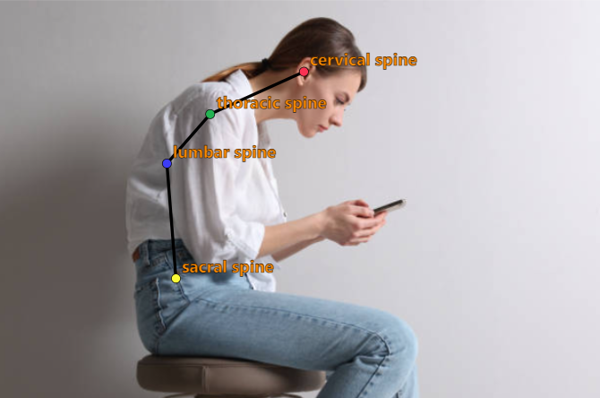
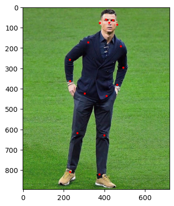
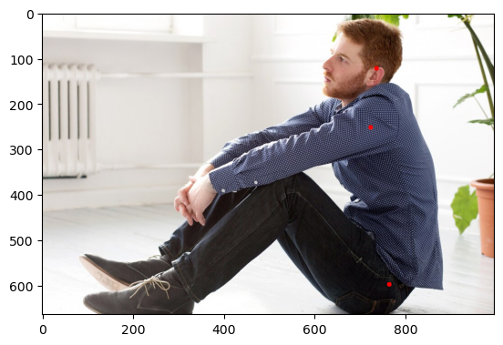
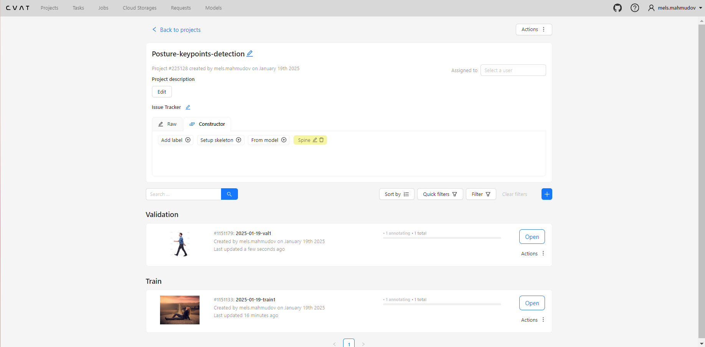
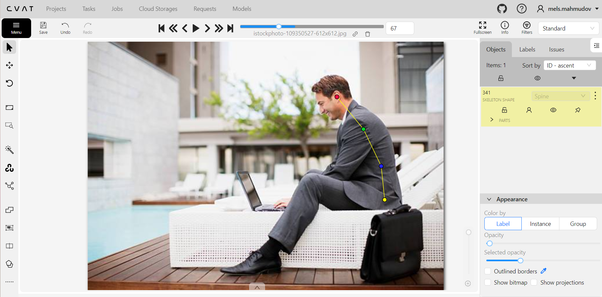
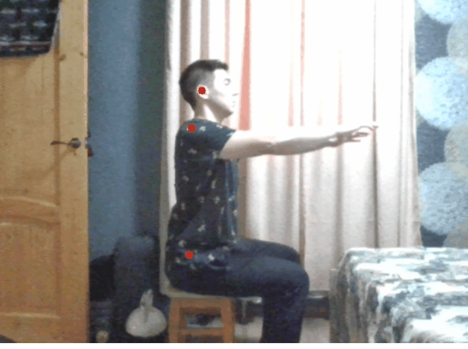
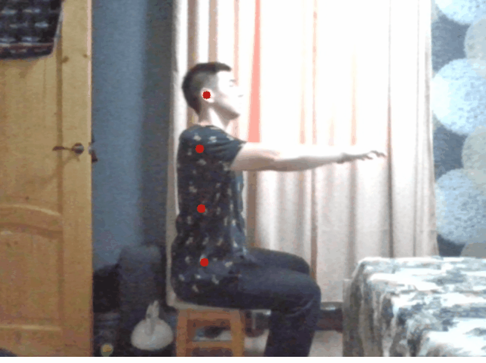

# Human Posture Analysis Using Spinal Keypoint Detection
---
This application was developed as the **final project of the Deep Learning School course at MIPT**. It allows you to track the position of a person's back while they work at a computer.

We collected and annotated a dataset of 300 images of people and fine‑tuned a YOLO11s‑pose model on it. The trained model detects spinal keypoints that can later be used to analyze and correct a person's posture.
To demonstrate the trained model, we implemented a web application using Streamlit. The application receives a video stream from the user's webcam and uses the model to detect posture keypoints.

## Problem exploration and description of the proposed solution
---
### Problem
Poor posture is one of the most common issues among people who work at a computer. This problem can lead to serious health consequences, including back, neck, and shoulder pain, as well as headaches and vision problems.

The main cause of poor posture when working at a computer is incorrect body position. When a person sits at a desk, they often lean forward to better see the monitor or keyboard. This leads to tension in the back and neck muscles, causing fatigue and deformation of the spine.

### Proposed solution
The proposed solution is to implement software that uses a camera placed to the side of the person to track the position of the back and notify the user when the spine deviates from a vertical position.

To track the position of the back, it is necessary to determine the spinal keypoints, which can then be used to analyze a person's posture. To detect these keypoints, you can either train your own model or find an existing detection model.

The simplest way to determine whether posture is correct using keypoints is to measure the distance between pairs of keypoints along the X‑coordinate. If the distance between two points exceeds a certain threshold, we consider the posture to be poor; otherwise, we conclude the posture is straight.

## Finding a trained model and dataset
---
### YOLO11s‑pose model
YOLO11s‑pose is a machine learning model designed for human pose estimation. It is one of the YOLO model versions focused on real‑time object detection and pose estimation. The number 11 in the name denotes the YOLO version, and the letter s denotes the model size.

In the standard YOLO11 pose model there are 17 keypoints, each representing a specific part of the human body. Here is the mapping from index to body joint:

- 0: Nose  
- 1: Left eye  
- 2: Right eye  
- 3: Left ear  
- 4: Right ear  
- 5: Left shoulder  
- 6: Right shoulder  
- 7: Left elbow  
- 8: Right elbow  
- 9: Left wrist  
- 10: Right wrist  
- 11: Left hip  
- 12: Right hip  
- 13: Left knee  
- 14: Right knee  
- 15: Left ankle  
- 16: Right ankle  

YOLO model demo:

Let us try to apply the YOLO11s‑pose model to our task. After model inference we will display only the keypoints that lie along the spine.

The model performs quite well at detecting the keypoints; however, for more accurate posture assessment, it is also necessary to track an intermediate point between the hip and shoulder keypoints. In the example above, all three points lie approximately on a straight line, yet the spine is actually curved due to thoracic and lumbar deviations.

Thus, the YOLO11s‑pose model “out of the box” does not allow full tracking of the back position.

### Dataset collection and annotation
#### Image collection
Given the limitation described above, we decided to fine‑tune the YOLO11s‑pose model on a new dataset containing images with annotations for all necessary keypoints.

We collected 300 images of people sitting and standing (with the camera positioned to the side). Most images were taken from these websites: https://ru.freepik.com/, https://www.istockphoto.com/ru.

We allocated 250 images for the training set and the remaining 50 for validation.

#### Annotation in CVAT
For image annotation we used the CVAT tool. CVAT (Computer Vision Annotation Tool) is an open‑source web platform for annotating images and videos, used for creating datasets for computer vision tasks.

Here is what the project looks like in CVAT:

Annotation process:

You can download the dataset and read its full description at  
https://www.kaggle.com/datasets/melsmm/posture-keypoints-detection/data.

## Model training
---
After collecting and annotating the dataset, we fine‑tuned the YOLO11s‑pose model on it. During training, we set the number of epochs to 200 and the batch size to 32. Training took about 23 minutes on a P100 GPU.

At the end of training, we achieved the following metrics:

| Class | Images | Instances | Box | P | R | mAP50 | mAP50-95 | Pose | P | R | mAP50 | mAP50-95 |
| ---- | ---- | ---- | ---- | ---- | ---- | ---- | ---- | ---- | ---- | ---- | ---- | ---- |
| all | 50 | 50 |  | 0.868 | 0.8 | 0.841 | 0.548 |  | 0.94 | 0.947 | 0.982 | 0.895 |

The training code is in the notebook `code/train.ipynb`.

## Model testing
---
Below is a comparison of the fine‑tuned model with the base YOLO11s‑pose model. We will see how the models detect keypoints in real time.

Results of the base YOLO11s‑pose model:

Results of the fine‑tuned model:

We can note that the fine‑tuned model detects keypoints with similar quality, but additionally detects one more keypoint, as intended.

The notebook `code/inference.ipynb` contains more examples of model inference on images.

## Demo development
---
We chose Streamlit as the framework for developing the web demo. Streamlit is a free, open‑source Python framework for building interactive dashboards and machine learning apps and sharing them. For the backend part of the application, we used FastAPI, a Python web framework for building APIs. Both services are wrapped using docker‑compose.

The application uses a pre‑trained YOLO model to detect body keypoints and evaluate posture correctness. If posture is correct, the message “Excellent posture” is displayed in green; otherwise, “Straighten your back” is shown in red. A separate window shows the webcam image with connected keypoints. If posture is correct, the keypoints are drawn in green; otherwise, in red.

Posture correctness is assessed by computing the distance between pairs of keypoints along the X‑coordinate. If the distance between two points exceeds a certain threshold, we consider posture to be poor; otherwise, we conclude the posture is straight.

The threshold is computed as:

$$threshold = K * l,$$

where `l` is the absolute difference between the Y‑coordinates of the extreme keypoints, and `K` is a posture‑correctness coefficient.

Using `l` ensures that the threshold scales with image size.

The coefficient `K` controls the allowed deviation of the back from the vertical and ranges within `(0, 1]`. The smaller `K` is, the more sensitive the program is to small posture deviations. Empirically, `K = 1/6` was found to be the optimal value.

## Demo testing
---
Let us test the developed web application:

Analyzing the example above, we can conclude that all keypoints are detected with good accuracy, and posture correctness is evaluated properly.
